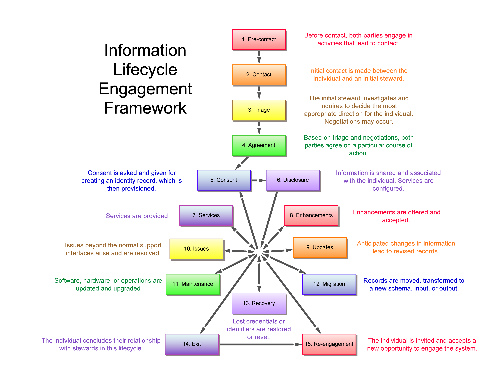

Joram 2.0.0
===========

A Self-Sovereign Identity Lifecycle Engagement Model

Joe Andrieu, Legendary Requirements &lt;[joe@legreq.com](mailto:joe@legreq.com)&gt;

Bob Clint, Spiritus &lt;[rclint@spirituspartners.com](mailto:rclint@spirituspartners.com)&gt;

> Special thanks to our contributors to Joram 1.0.0[1]

**Introduction**

Joram is a 25 year-old, single male from Syria. He flees his home
country, leaving behind his family, because he fears persecution. He
finds his way to a refugee boat that makes its way to a beach in Greece.
Joram brings only the clothes on his back: no identity papers, no
technology. Joram speaks Arabic, and English[2] but not Greek.

Joram has corresponded with an aunt in France, who has promised to
provide housing and help Joram find a job. Joram has some education, is
a skilled welder, and is held in high regard by his community back home.
He is responsible and has cared for his mother and siblings, but suffers
from type 2 diabetes.

This document envisions a new way to handle identity information through
the examination of the experiences of a fictional individual, Joram, as
he seeks refuge in Greece on his way to resettlement in France. We use
an *Information Lifecycle Engagement Model* as described at the end of
this document.

**Stewards**

Throughout Joram’s experience, several different individuals create and
query information in a data store. These “stewards” are stewards of both
the identity information and of Joram’s physical person.

> **Achilles** -- Greek gate officer, Camp Beta
>
> **Alexandra** -- Greek border patrol soldier working with Spiros
>
> **Dr. Andropoli**s -- Camp Doctor, *Medicins Sans Frontier*, Camp
> Alpha
>
> **Barbra** -- UNHCR outtake officer, Camp Beta
>
> **Bohlale** -- Intake Nurse, *Medicins Sans Frontier*, Camp Alpha
>
> **Celine** -- UNHCR intake officer, Camp Alpha
>
> **Dion** -- UNHCR transition coordinator, Camp Alpha
>
> **François** -- French resettlement case worker with France Terre
> d'Asile (FTDA)
>
> **Jean-Pierre** -- French immigration agent
>
> **Markos** -- Greek intelligence officer
>
> **Mary** -- Technical administrator and reunification officer, Camp
> Beta
>
> **Mike** -- Nurse, Camp Beta
>
> **Spiros** -- Greek border patrol soldier who finds Joram and the rest
> of his fellow travellers
>
> **Dr. Zeneca** -- Pharmacist, Camp Beta
>
> **Guido** -- Camp administrator, Camp Milano

**Others**

Two other Syrian refugees also play a role in Joram’s story.

> **Fatima** -- Qasim’s wife, whose arrival in Greece is a surprise to
> Joram
>
> **Qasim** -- A co-worker of Joram whose name Joram uses to protect his
> family

**Assumptions**

All of the stewards in the model have a physical device with Internet
access. Through this device, they are able to create and query entries
in a “Distributed Self-Sovereign Data Store”. (data store). The details
of how that data store work are outside the scope of this document.
However, this data store is where Joram’s self-sovereign identity
accretes over time as he interacts with the stewards. When interacting
with stewards, Joram mediates selective disclosure of that accreted
identity data.

As a strawman approach for the sake of this discussion, we make a few
assumptions about this data store:

1.  A secure element protected by a pin or and iris biometrics that 
    can store Joram’s credentials. The secure element is embedded in Joram’s 
    camp bracelet.

2.  A semi-private ledger--governed by the UN--enables approved stewards
    to view and add records in the data store, independent of any
    centralized identity provider or service.

3.  The software run by the stewards is certified to meet requirements
    set by the UN to assure the integrity of the consent and disclosure
    ceremony and subsequent data hygiene.

4.  Before each steward interaction, Joram unlock access to his data 
    using his biometrics.

5.  In each steward interaction, there is an authorization ceremony that
    requests permission to both query *and* create associated records.
    Consent for specific scope is given or denied in every interaction.

**Stage 1 — Pre-contact**

After a difficult and dangerous journey, Joram reaches the beaches of
Greece. At some point during his travels, he used the last of his
insulin. He is dehydrated, painfully hungry, and fatigued. He is seeking
access to insulin treatment, water, food and other basic needs. He is
also trying to avoid getting shot or harmed by either criminals or the
military. His challenge is to find someone who can help him and his
colleagues on the boat.

Spiros is a member of the Greek Border Guard. Spiros starts his shift by
authenticating himself on his device, with the Border Guard. Attending
his daily briefing, he receives his mission, which is to patrol the
beach. The mission briefing includes a reference to the UN resolution
under which they are operating. He enters a record in the data store
when he begins the mission. He is on patrol when his unit responds to a
report of about 20 people milling around a local beach, which also gets
entered into the data store.

*Data Records: Spiros, with Border Guard authority: starting mission
with agent, location, timestamp, root authority. Investigating report of
unknown individuals with agent, location, timestamp.*

**Stage 2 — Contact**

After avoiding the border team with the dogs, Joram sees Spiros
patrolling. He recognizes that Spiros, who is in uniform, is a Greek
authority, who may be able to help him. He feels there is a better
chance of starting a conversation without getting hurt because Spiros
doesn’t have any dogs. He waves Spiros down, calling out for assistance.

Spiros sees Joram, records contact and approaches.

*Data Records: Border Patrol: Confirmation of contact with agent,
location, timestamp.*

**Stage 3 — Triage**

Approaching Joram, Spiros first needs to identify if Joram poses a
threat. Spiros activates the spotlight on his weapon and starts yelling
at Joram to get on his knees, hands on his head. He initially speaks in
Greek, then in English, which Joram understands.

An initial round of questions asks for Joram’s identity, why he is
there, where he is from, and where he is going. Joram initially ignores
the questions, saying “Asylum! Asylum. Help.” After some coaxing, he
claims he is from Damascus, is fleeing for his life, injured, hungry,
and seeking asylum with family in France. To protect his family in
Syria, Joram withholds his real name, instead providing that of his
co-worker, ‘Qasim’. He also tells Spiros there is a group of refugees
further down the beach.

During this triage interview, Spiros’ partner, Alexandra takes a photo
of Joram and cross-checks this with a bad actor database[3].

Spiros asks Joram to repeat his story a couple times, finding it
generally credible. He decides to investigate further with the rest of
the refugees. Joram leads the way.

Spiros’s squad approaches the rest of the refugees and Joram explains in
Arabic that everything is ok. “This man can get us to refugee camp!”

While the squad secures the area, Alexandra takes photos and names of
all the refugees present, checking against the Greek bad actor database.
Her software packages this information into a report she sends to
Spiros.

Spiros reviews the report, which shows all refugees passed the bad actor
check and appear to be legitimate. Spiros records his observations of
the incident, and forwards the report to HQ, requesting that they treat
the group as potential refugees. His device automatically attaches his
location, timestamp and signs with his digital signature.

*Data Records: Contact photos, names, with location, timestamp, agents
(Alexandra & Spiros). *

**Stage 4 — Direction**

Spiros receives approval to relocate the refugees to Camp Alpha. A truck
is on its way.

Spiros tells Joram he will be going to UNHCR refugee Camp Alpha, where
he will be able to get food and shelter and deal with his diabetes.

Joram agrees to go to the refugee camp, relieved that he’s given that
option instead of something far worse. Joram explains to the other
refugees that everything is going to be ok--that they are going to go
together to a nearby UNHCR refugee camp for food, shelter, and medical
care. The group cheers and appears glad to comply with directives.

Joram joins the rest of the refugees in the box truck and is taken to
Camp Alpha.

*Data Records: Border Patrol. Records of contact, story of origin:
Joram’s false name, “Qasim”, the names given by and photos of all the
refugees, claimed origin, Damascus, etc.*

**Stage 5 — Consent**

At camp Alpha, Joram and the other refugees are queing to be registered. 
UN volunteer Celine matches Joram to the record created by Alexandra and 
asks Joram to confirm that it is his. She then play an audio file in 
Joram’s local language explaining what data they will gather and what 
they will do with it.  It explains that he will have control over who can 
access this data through powerful cryptography--that neither the Greek 
nor Syrian governments will be able to access any of this information 
without his assistance. She then asks for and receives Joram’s consent 
to create a profile for him.

Celine give him a QR code printed on paper that he presents at every booth. 
He move to the next booth where another volunteer records his fingerprints 
and iris biometrics then to another one where they take his picture. 
At the last booth, they show him all the informations collected and ask 
him to confirm all of them. Finally they issue him a new bracelet with 
a secure element that store *his records and biometrics templates*. The 
Volunteer gives Joram the new bracelet, giving him control over his records
in the distributed data store. He can also use it to access goods and 
services in Camp Alpha. Celine and Joram use the newly provisioned 
bracelet to record Joram’s consent to participate in the camp refugee 
management system.

*Data Records: biometric templates, passphrase (in secure element),
intake records (from Greek military), consent receipt.*

**Stage 6 — Disclosure**

Celine requests additional information and adds her notes to the data
store. Joram answers more questions about who he is, but sticks with the
story that he’s “Qasim”. Celine asks about Joram’s trade skills. Joram
cites his work as a welder.

Nurse Bohlale takes Joram’s vital signs (temperature, weight, pulse,
blood pressure) and medical history. Joram tells her about his diabetes
and Bohlale sets an appointment for him to see Dr. Andropolis.

*Data Records: Camp Record. Contains: Qasim’s name and basic
information; health information; skill information. A real world
quasi-permanent token (bracelet).*

**Stage 7 — Services**

Joram receives a thorough medical examination from Dr. Andropolis, who
confirms the diabetes diagnosis. The doctor prescribes a daily allowance
for insulin and stores it in the data store, using the embedded ID in
Joram’s bracelet.

Joram regularly visits the camp clinic and uses his bracelet to ask for
a blood sugar check with Nurse Bohlale, who also gives him any necessary
injections. Bohlale verifies his prescription from the data store and
records an entry of test results and any injections.

*Data Records: Diagnosis, insulin prescription, request for sugar check,
test results, and disbursement.*

**Stage 8 — Enhancements**

In Joram’s weekly check-in with his UNHCR transition coordinator, Dion
reviews his profile with to see how she might be able to help.

Seeing Joram’s skills inventory, Dion asks him if he would be interested
in getting certified as a welder. Certification could be useful for his
refugee application and subsequent employment. Joram thinks that’s a
great idea. Dion walks Joram through the application process, again
attaching supporting evidence and adding her endorsement. Dion explains
that, pending the application, Joram will need to schedule a
certification test.

Dion performs a local search of the family reunification list to see if
any other refugees have posted requests to find relatives matching
Joram’s profile. The search turns up Qasim’s wife, Fatima, who has
posted looking for Qasim, 25, from Damascus. Joram recognizes the photo
of his friend’s wife and confirms the relationship. He believes they
will both be better off together in the camps. Dion explains the
relationship qualifies him for relocation to be with Fatima. Joram
accepts. Dion requests the relocation, submitting Joram’s record as the
“missing” Qasim.

Upon receiving the request, Mary at Camp Beta first confirms the
relationship by asking Fatima if she knows “Qasim”. Fatima confirms the
relationship and her wish to be reunited. Mary checks the estimated
resource requirements for “Qasim”, including his medical needs as well
as standard accommodations and reviews Camp Beta’s resource
availability. She approves the relocation and authorizes the required
resources, pending Joram’s arrival at Camp Beta.

*Data Records: Asylum application, Welding certification application,
relocation request.*

**Stage 9 — Updates**

Upon confirmation of the relocation request, Dion creates a travel chit
for Joram that she stores on his bracelet, scheduling him on the next bus 
to Camp Beta. On the day of the transfer, Dion records Joram’s departure 
in the data store, deallocates his Camp Alpha assigned resources, and 
makes sure Joram takes the bus.

Upon arriving at Camp Beta, Joram presents his bracelet and give access to 
his travel chit to Mary who creates a local record for Joram, records his
arrival in the data store, and completes the allocation of resources at Camp
Beta. Once in the system, Joram is reunited with Fatima.

*Data Records: Prescription, camp assignment. *

**Stage 10 — Issues**

Two weeks after reuniting in Camp Beta, Joram and Fatima are arrested
and taken for interrogation. Security has concluded that Qasim of
Damascus, is a terrorist. Under interrogation by Greek intelligence
officer Markos, Joram and Fatima hold to their story, fearing reprisal
for lying.

Markos runs Joram and Fatima through the Greek bad actor check. Both
come up clean. After talking with Mary, the camp administrator, Markos
asks both if they can share any information from the data store that
might support their claims. They each share a selection of records from
their life in the camps, showing where they have been and when. The real
Qasim is wanted for leading a deadly attack in Athens just days before.
The data store provides Joram and Fatima compelling alibis: a
consistently documented tamper-resistant history showing they could not
have been in Athens during the attacks. Markos asks Mary to print out
the records.

Meanwhile, the real Qasim attempts to get into Camp Beta looking for
Fatima. During intake, he fails the Greek bad actor check. Security
arrests Qasim and brings him to Markos.

Faced with the “real” Qasim, Joram admits he lied. Qasim, in turn claims
HE is the real Qasim, who has been in these camps for weeks. Markos asks
Qasim a few corroborating questions and gives Qasim Joram’s device to
authenticate with his biometrics. Qasim fails. Clearly, the Qasim in the
room is NOT the same individual that has been in the camps under that 
name. Given the alibi in the data store and the evidence against Qasim,
Markos releases Joram.

*Data Records: Camp Records reviewed. Joram’s named updated to “Joram”.*

**Stage 11 — Maintenance**

Sometime during Joram’s tenure at camp Alpha, Nurse Bohlale sees an
alert in her clinic software app that a new version is available, with
additional support for a new prescription data model. She reviews the
new features and notes that the currently installed version is forward
compatible with the new prescription format, although some features will
be unavailable. She decides to wait until the end of the day to try the
new software. When she does, she notices a layout bug that obscures
patient information. She captures a screenshot and reports the bug, then
rolls back to the previous version.

While at Camp Beta, there was a flaw discovered in the version of the
bracelet Joram is using. Nurse Mike tells Joram to turn in his current
bracelet and replace it with an upgraded one. Joram heads to the camp
administrator’s office where he first authenticates as himself, then
pairs the upgraded bracelet with his old one. The old bracelet updates
the data store record with a new authentication credential from the new
bracelet. Now Joram can use the new bracelet to authenticate.

*Data Records: Support for new “prescription 2.0” format, authentication
credentials*

**Stage 12 — Migration**

In Joram’s weekly check-in with his UNHCR transition coordinator, Dion
reviews his profile with an eye to preparing Joram’s asylum application.
Joram selectively shares the data she requests. She sees that he has an
aunt in France and confirms that France is Joram’s first choice for
immigration. She helps Joram fill out the application form, attaching
supporting evidence from the datastore. Once complete, Dion submits the
application to OFPRA.

*Data Records: Aunt’s contact information, medical records, welding
certificate, entry date, misc. *

**Stage 13 — Recovery**

Upon entry into Camp Alpha, Joram’s bracelet is configured to exchange
recovery credentials with the first five stewards he interacts with, so
they can act as recovery advocates. Over time, Joram adds and removes
advocates to establish a group he trusts. As he assigns advocates, he
also encrypts his identifier, his name, and his photo for each advocate.
The advocate records this information in the data store so they can
retrieve it later.

One day, Joram loses his bracelet. When he visits Mike for his blood
sugar check, Mike recognizes him and uses his authority as a nurse to
provide emergency care. He then directs Joram to Mary, the Camp Beta
technical administrator. Mary issues Joram a new bracelet, configured
for recovery.

Joram takes this new bracelet to a majority of his recovery advocates
for a recovery ceremony. The first advocate looks up Joram’s identifier
and confirms the information matches the person in front of them. Joram
stores that identifier and uses it for subsequent recovery ceremonies.
Each recovery advocate, after assuring themselves that Joram matches the
name and photo on record, post a recovery assertion. That assertion
states

1.  Joram’s identifier

2.  that the advocate knows and recognizes Joram,

3.  that Joram has requested recovery

Each advocate generates a signed, single-use token tied to their
assertion. Once Joram has gathered a majority of tokens from his current
list of recovery advocates, he posts a recovery claim to the data store.
He can now use his new bracelet to manage credentials associated with
his original identifier.

Each time that Joram and an advocate go through the recovery ceremony,
Joram also adds them as a recovery advocate for his new bracelet.

*Data records: Joram’s name, photo of Joram, recovery assertions,
recovery tokens, recovery claim.*

**Stage 14 — Exit**

After some months, Joram gets a response to his asylum application and
is granted a visa to join his aunt in France. Barbra, the UNHCR outtake
coordinator at Camp Beta, conducts an exit interview with Joram, double
checking his name and photo, then and reviewing his exit plan. She
confirms his destination and the bus route \# that will get him there.
Joram is given an option to back up his information with the UN,
encrypted so that only he can access it with UN assistance. Joram
selects the data he wants exported to the UN including the exit
geo-stamp and record. Barbra records the list of selected records for
later archival.

On the day of travel, Barbra meets Joram and several other refugees for
a final check before boarding. She calls out Joram’s name, authenticates
him on her device, and confirms he is scheduled for travel today, on his
particular bus. He keeps his bracelet. Joram boards the bus and is on
his way to a new home.

After his bus leaves, Barbra geo-timestamps his exit, records it in the
data store, and triggers the UN export. Joram’s data in the data store
is then marked for deletion and every Steward on record is notified of
the deletion request. The data store deletes the information
immediately. All Stewards process the request for deletion according to
their own data privacy compliance process. The deletion notice also
informs Stewards that resources allocated to Joram should be made
available for re-allocation.

**Stage 15 — Re-engagement**

En route to France, Joram’s bus breaks down in northern Italy. Along
with his fellow refugees, he is taken to a UN camp outside Milan. Upon
entry, the camp administrator Guido asks if anyone needs medical care.
Because of his diabetes, Joram speaks up and Guido suggests importing
his backup from the UN archive. With his bracelet, Joram provides an
elevated authentication using biometrics; the bracelet provides the
unique id for the back-up and the credentials needed for decryption. The
system decrypts and uploads Joram’s archived data to the live data
store. Joram now has full access to his prescription, medical records,
and related camp history, allowing the stewards at camp Milano to use
that information to provide services such as glucose checks and insulin
injections. (Joram will have the opportunity to close out his records
again when he leaves this temporary camp.)

*Data Records: UN Archive Import (from encrypted backup)*

**Information Lifecycle Engagement Model**

The 15-stage model presented here is an instance of an Information
Lifecycle Engagement Framework, as illustrated below.

Each phase in the model is a concise description of one or two
interactions illustrating the phase. Rather than attempting to describe
every interaction across multiple customers, the engagement model
captures illustrative interactions for each phase in the lifecycle of a
particular individual’s engagement with the system. The whole should be
readable as a sympathetic narrative, clarifying the motivations of all
parties and the viability of the described use. We use it to tease out
the human requirements independent of the underlying technology.

This Information Lifecycle Engagement Model is based on the work of Joe
Andrieu and Ian Henderson from [*The
Customer-Supplier Engagement Model Quick
Starter*](http://kantarainitiative.org/confluence/display/infosharing/Customer-Supplier+Engagement+Model+Quick+Starter)[4]*.*
We have re-interpreted and expanded the the 12 phases of the
Customer-Supplier Engagement Model for suitability to a Syrian refugee
in Greece. Our initial change shifted the language from commercial
concepts to more general identity information. We also added
Maintenance, Migration, and Recovery phases to address the needs of
operating an ongoing system.

The premise remains: working through each phase in the model provides a
comprehensive yet lightweight review of the necessary transactions. This
can be accomplished prior to a detailed specification of the system,
providing a coherent statement of functional requirements even as design
and implementation details change.

[1] [https://github.com/WebOfTrustInfo/rebooting-the-web-of-trust-fall2016/blob/master/final-documents/joram-engagement-model.pdf](https://github.com/WebOfTrustInfo/rebooting-the-web-of-trust-fall2016/blob/master/final-documents/joram-engagement-model.pdf)

[2] *English is chosen to make our work in this document easier.*

[3] The Greek Border Authority has its own proprietary database, outside
our scope.

[4] [http://kantarainitiative.org/confluence/display/infosharing/Customer-Supplier+Engagement+Model+Quick+Starter](http://kantarainitiative.org/confluence/display/infosharing/Customer-Supplier+Engagement+Model+Quick+Starter)

NOTES
=====

As part of his asylum application, Joram works with Jean-Pierre, the
French immigration agent, to export a subset of his camp records to a
resettlement agency in France. This includes his aunt’s address and
contact information. The information selected by Joram is transferred to
a data store in France, retaining its non-repudiable characteristics and
its chain of custody.

