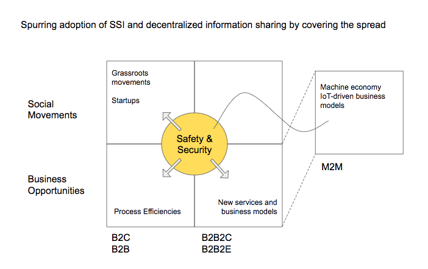
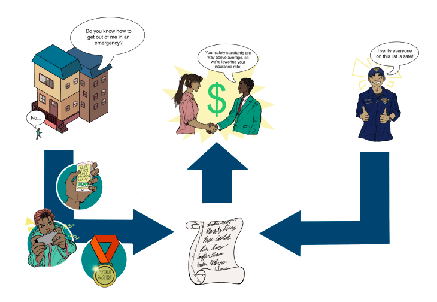
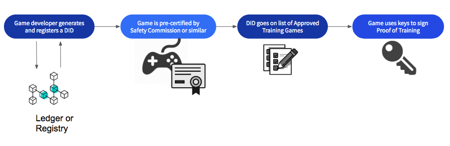
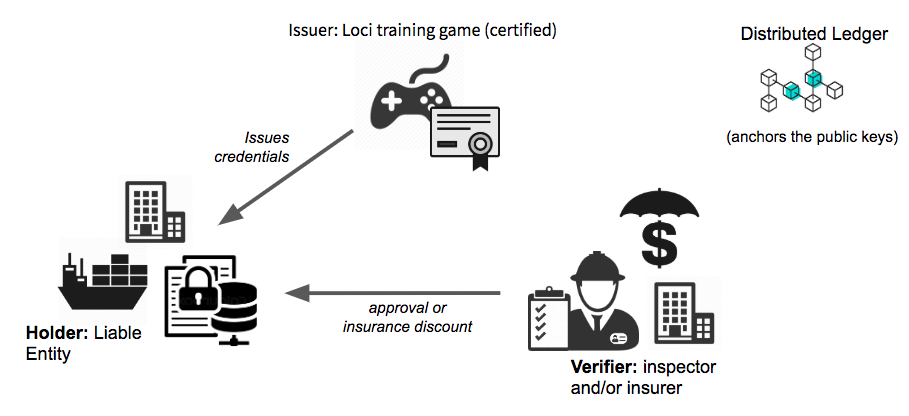
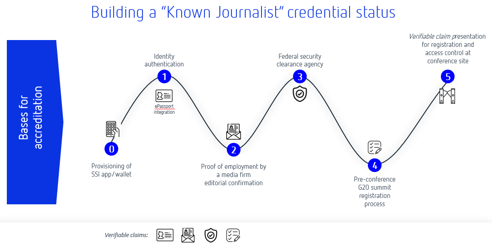

# Driving Adoption with Focus on Basic Human Needs: Safety and Security

#### How safety and security credentials are ideal building blocks for the adoption of larger SSI-based systems of proof and authorization. 

#### Presented by [*Sam Mathews Chase*](mailto:%20samantha@venn.agency), [*Joni McKervey*](mailto:%20joni@venn.agency), [*Carsten Stöcker*](mailto:carsten.stoecker@spherity.com), and [*Daniel C. Burnett*](mailto:daniel.burnett@consensys.net)

#### Submitted to the 8th Rebooting the Web of Trust Technical Workshop

#### March 01-03, 2019, Barcelona

**Keywords:** human needs, safety, security, adoption, decentralized
identity, credential system, verifiable credentials, identity,
self-sovereign, decentralized identifier

## Abstract

This paper investigates two primary forces that have the potential to
drive adoption of decentralised technology by both individuals and
enterprises: safety and security. Among the most basic human needs,
safety and security are fundamental to the functioning of society, and
without them collective existence would fall into chaos. By protecting
the sovereignty of each individual and ensuring access to secured shared
resources, governments maintain a state in which its citizens may
thrive.

In many areas, existing systems used to uphold safety and security
regulations are outdated, inefficient, and vulnerable to fraud or abuse.
Through four distinct use cases this paper proposes to demonstrate that
measurable improvements can be made to many safety and security-related
systems with the use of verifiable credentials. The implementation of
these use cases offers a unique opportunity to design efficient,
accurate, secure systems for information exchange that benefit both the
individuals and organizations using the system, while simultaneously
laying the foundation for broader adoption of personal data wallets.

In this paper we will examine four use cases: updating fire safety
training with spatial computing; reducing fatigue-related workplace
accidents with sleep data; issuing security clearances for journalists
through background checks; and managing trust in
accident-prevention systems for autonomous driving programs. Each of
these use cases will track a user’s journey and highlight the
implementation of verifiable credentials as a means to increase trust
and efficiency while also protecting personally identifying information
(PII).

Our goal is to outline systems using self-sovereign principles that
provide mutual benefit to system administrators and users and that have a
net positive impact on process efficiencies. Each use case describes a
decentralised-credential system model that can be further adopted at
scale.

## Verifiable Credentials

The original motivation behind the Verifiable Credentials (VC)
standardization work (https://w3c.github.io/vc-data-model/) was twofold:
to provide equivalents to the physical credentials we carry around with
us such as driver’s licenses, passports, and diplomas; and to solve the
problems that people claim they need identity to solve, but without
creating a new, restrictive notion of identity.

VCs have both a simple idea and a simple structure. A VC contains:

1.  An identifier (ID) for the VC
2.  An Issuer (also represented as an ID)
3.  A Subject (also represented as an ID)
4.  One or more claims, each listing a claimed property of the Subject and its claimed value, according to the Issuer
5.  A proof section containing cryptographic evidence to prove that the Issuer actually issued the listed claims. This evidence could be a signature over the whole credential or a zero-knowledge proof that has the same effect. Note that VCs don’t provide verification of the truth or falsehood of the claims, just verification that the claims were made.

Although VCs have other properties, such as revocation or
expiration of claims, timestamps, the ability to make claims about multiple Subjects, etc., those are all optional.

Note something very important aboveL there is a Subject identi*fier*
(the ID), but no claimed identi*ty* assumption. While
personally-identifiable information can be provided as claims in a VC,
many use cases (including some of ours) do not require that.

### Why Start Here?

As a technology intended to benefit humanity rather than just being
“another way to create a commercial identity”, adoption of verifiable
credentials will depend on utility beyond pure commercial drivers.
Safety and security are matters that transcend politics and preferencesL systems of critical infrastructure, safety, and security impact
governments, organizations, and individuals in different ways, but with
equal necessity. Technology-driven complexity and growth are changing
the world around us, and we can all agree that legacy systems of safety
and security are due for an update; too many safety and security measures
continue to hinge on inefficiencies like clipboards, checklists,
intermittent inspections, and easily forged paper credentials.

Changes to safety and security practices require both widespread public
adoption (grassroots) and organizational support (commercial,
governmental). Both can be spurred into action by demonstrating the
value of digital credentials to increase accuracy and efficiency in
these legacy systems, while using only the absolute minimum user PII and
reducing risk for all groups involved.

## Implementation: Fire Safety Credentials

### The Problem

Fire safety protocol commonly requires building owners to post maps of
safe evacuation routes and run periodic (often infrequent) evacuation
drills.

Due to information overload and a growing reliance on mobile GPS
guidance, the average person’s ability to navigate in an emergency is on
the decline. As a result, maps and signs are no longer sufficient safety
measures. In addition to needing a better way of preparing people for an
emergency, liability is a growing burden for anyone responsible for
people’s well being in a public capacity (e.g., employers, transportation
authorities, live events managers, public buildings). Insurance costs
are ballooning, populations are growing and urban/exurban areas are
increasing in complexity. There is a growing need to better prepare
people for an emergency, and to prove that the greatest safety measures
possible are being taken as well.

### The Solution

A system that uses WebXR gaming and groundbreaking neuroscience to teach
emergency evacuation routes and safety exits to people. The game issues
a VC for each successful completion of a game. The VCs are posted to the
liable organization’s ledger and verified by a trusted third party
(e.g., Local Fire Department). This ledger can be used as proof of
compliance, and may be used to leverage reductions in insurance rates
based on proof that building or transport occupants are better trained
to respond safely in an emergency.

### Safety Ecosystem with Verifiable Credentials

### Safety Game Overview: Game Verification

### Safety Game Overview: Workflow

The Holder (Liable Entity) sends a safety training game to anyone for
whom the Holder is liable to protect (Employee, Occupant). The
individual registers their unique game ID, plays the safety training
game to its completion and is issued a credential by the game software.
The credential gets sent directly to the Credential Storage Software (in
this case, there is no need for the Employee/Occupant to actually carry
it around), where it is stored until verification is required. The
ledger of credentials is presented to the Verifier (Fire Department,
Government, Insurance Broker) by the Holder, and the Verifier validates
the list of proofs on the ledger.

**Employee/Occupant benefits:**

-   Increased safety: Site-specific safety training that combines spatial memory and cognitive learning tools to reinforce critical safety information creates a safer work environment and reduction in workplace death and injury.
-   Non-surveillant: VCs provide path to participation for any and all building occupants without disclosing PII.

**Liable Entity Benefits:**

-   Accuracy: Training ledgers provide detailed and up-to-date records of compliance with safety code regulations and organizational due-diligence.
-   Lowered overhead: Safer spaces lead to less frequent claims and lower insurance rates.
-   Non-surveillant: VCs eliminate risks (and costs) associated with collecting, holding and protecting PII.

## Use Case: Safety Credentials for Sleep

For construction companies wanting to incentivize positive sleep habits
and overall health and wellness for employees to reduce on-the-job
accident and injury rates, we propose a sleep credential system that
uses verified credentials to reward employees for achieving sleep
goals.

Unlike the current option, where employers collect employees’ raw
health data from wearable devices like FitBits, this system does not
collect or share employees’ personally identifying information.

### The Problem

Lack of sleep is a leading cause of death and injury on construction and
manufacturing job sites in Canada. More than 43% of workers are
sleep-deprived[^1], and construction and manufacturing report the
highest number of workplace injuries and death out of all occupations
tracked by the Association of Workers' Compensation Boards of
Canada[^2].

To support the creation of a culture of health, wellness, and safety,
companies are adopting the practice of collecting employee health data
from wearable devices[^3] to credit positive health practices and lower
the occurrences of death and injury.

While the motivation is noble at its core, the practice is surveillant
and invasive. Sharing your personal health data should not be a
condition of your employment. These companies, however, have no other
way to verify an employee’s sleep data. Additionally, companies who
collect employee data are also taking on the cost and liability that
comes with storing, managing, and protecting it.

### The Solution

Use VCs to provide employees a way of attesting their sleep habits meet
the minimum safety requirements set out by their employer without
disclosing any of their raw health data. Use an intermediary (e.g.
WorkSafe BC) as verifier for the credentials. Employees who share VCs
attesting they’ve met sleep thresholds are rewarded for contributing to
improved job site safety and wellbeing. Employee’s private information
is protected, and employers do not take on the liability and costs of
collecting personal data.

## Use Case: Journalist Accreditation for Security Sensitive Events

### The Problem

In journalism, accreditation refers to the admission of media
representatives to certain events. Accreditation requirements (and related security requirements) are increasingly important at
high-profile conferences such as G20 or WEF. Participants attend from
countries all over the world and multiple security organisations are
involved, making background checks and clearances complex and
labour-intensive. Most security and clearance certificates are still
based on paper processes, leaving a concerning margin for error and
vulnerability to fraud.

The range of accreditation requirements extends from the simple issue of a press admission ticket
without prior registration to authentication and a security check in
advance, as well as agreements as to which journalist will attend
which part of an event in which way (photojournalism, written reporting,
television or radio recordings).

The accreditation is often based on proof that the media representative
is actually a journalist. This can be done by means of an editorial
confirmation, work samples, or a press card. The bases for accreditation
are determined by the organiser, so they are not uniform in nature.

In most cases, accreditation is associated with the issue of special
badges to media representatives.

Today, when a journalist arrives at a high-profile conference, on-site
security teams must determine admissibility -- permission to enter the
conference -- rapidly and accurately. A security employee then determines
the class of admission (e.g. temporary access, access to specific parts
of the conference), the need for further scrutiny, or the reason for a
refusal of entry such as false authentication, revoked editorial
confirmation, revoked security clearance, or void conference ticket. For
example, at the last G20 summit in Hamburg, Germany, policemen used
paper lists of the names of people who had their security clearance
revoked prior to the conference, cross-referencing the list with the
names of each person entering the conference.

### The Solution

Digitise the accreditation and clearance process for journalists to
reduce costs and increase event security.

Journalists employed by approved media companies or publications have
their identity and employment verified by a security clearance agency,
issued as a VC to their personal wallet. Upon registering for a
conference, the journalist’s credentials are verified and they are
issued a digital media pass and clearance status as temporary
(time-constrained) VCs that can be revoked if necessary. Revocation
eliminates the problem illustrated above, wherein changes in clearance
status were handled manually by cross-referencing all arriving attendees
with a printed list of those whose status had been downgraded.

The benefits of using VCs in the use case of journalist accreditation
are:

1.  Digitisation of the accreditation process prior to the event as well as on-site registration and verification of the journalist
2.  Increased security in issuing, revoking, and verifying accreditation-related claims
3.  Increased efficiency through automation and cost reduction

### Building a “Known Journalist” Credential Status[^4]

#### Example

Washington Post (WP) employs a journalist and the journalist accredits
as a WP staff member for G20 summit. The journalist receives a
conference accreditation together with access restrictions from the
organizer.

Journalists can only be admitted to the respective conference during the
on-site registration process if:

1. They can prove their identity.
2. The identity card is verifiably stored under its digital identity claim from the authentication provider.
3. They can prove that they are still employed, by a DPA Claim from DPA (editorial confirmation);
   * that they have a positive OSiP review Claim of the OSiP procedure;
   * that they are accredited and have access permission to parts of the
event as claimed by the organizer; and
   * that their accreditation fulfills further requirements according to the accreditation
bases for further claims.

Media companies and organizers can validate the entire set of claims
including their revocation prior to the conference as well.

## Use Case: Verifiable Driving Event Data Chain[^5]

In addition to systems that focus on attestations about people (ID,
clearances, certifications etc), cyber-physical systems like automated
driving and driver assistance require highly trustable information
chains to function safely.

### The Problem

The analysis of dangerous driving situations and calculation of control
signals to prevent dangerous situations is an important capability that
requires data from different sources to be processed by different
algorithms.

Dangerous driving events can be divided into two groups: (1) the
interaction between a driver’s vehicle and the road environment, and (2)
the interaction between a driver’s vehicle and nearby vehicles[^6].

Diverse methods for enhancing driving safety have been proposed. Such
methods can be roughly classified as passive or active. Passive methods
(e.g., seat-belts, airbags, and anti-lock braking systems), which have
significantly reduced traffic fatalities, were originally introduced to
diminish the degree of injury from an accident. By contrast, active
methods are designed to prevent accidents from occurring. Driver
assistance systems (DAS) are designed to alert the driver, or an
autonomous driving module, as quickly as possible to a potentially
dangerous situation.

The two classes of driving events may occur simultaneously and lead to
certain serious traffic situations. The automotive industry is working
on active methods and systems including machine learning algorithms to
analyze these two kinds of events and determine *dangerous situations*
from data collected by various sensors and data from external sources.
The machine learning output labels, about dangerous curves, road
obstacles, or poor vehicle conditions, are fed into control, transaction,
and risk systems. In distributed mobility systems the trustworthiness
and accuracy of the output labels must be independently verifiable.

The ultimate question is: How can I trust vehicle identity data, third party data, and
machine learning labels that are created and processed along a
distributed mobility value chain?

### The Solution

To achieve trustworthiness of output labels we are planning to blend the
verifiable data chain concept with historic driving event data and black
box algorithms to build a verifiable agile driving solution:

-   Interoperable decentral identity and verifiable digital twinning protocol
-   Cryptographically secured and blockchain-enabled data chains
-   E2E integration of remote sensing (telematics) data and machine learning algorithms

This approach demonstrates how the following trust problems can be
addressed with decentralised identity systems:

-   Vehicle provenance and configuration
-   Provenance, verifiability, and integrity of the driving event input data (or telematics data)
-   Integrity and transparency of driving event data chain when multiple 3rd party intermediaries are involved
-   Credentials about benchmarking of ML algorithms and training data
-   Aggregated accuracy and trustworthiness of predicted ML labels and  attributes

## Conclusion

Safeguarding human life and ensuring our shared environments (city
streets, workplaces, homes, gathering spaces) are secure are critical
parts of a functioning society. Solutions that improve safety and
security processes are not only needed at this time, but have the
potential to operate at massive scale as well.

Verifiable credentials offer key upgrades to the systems addressed in
these use cases, above that which other tech-related solutions cannot provide (e.g.,
minimum disclosure, protection of PII, and trustless exchanges).This makes
VCs ideally suited for adoption by governments and liable entities like
employers, whose management of peoples’ information and responsibility
for their safety exposes them to high amounts of risk.

The use cases in this paper represent viable, real-world opportunities
to spread adoption of self-sovereign tech without relying on mass
adoption of personal data wallets or “one platform to save us all” types
of solutions. In most cases these systems can be deployed without
requiring the use of personal wallets -- at least to start -- allowing the
systems themselves to be improved by the use of VCs as managed at the
infrastructure/oversight level and paving the way for the use of
personal wallets down the road.

[^1]: Fatigue – You're More Than Just Tired. (n.d.). Retrieved from [*https://www.nsc.org/work-safety/safety-topics/fatigue*](https://www.nsc.org/work-safety/safety-topics/fatigue)

[^2]: [*http://awcbc.org/?page\_id=14*](http://awcbc.org/?page_id=14)

[^3]: Richardson, S., & Mackinnon, D. (2017, April). Left to Their Own Devices? Privacy Implications of Wearable Technology in Canadian Workplaces. Retrieved from [*https://www.sscqueens.org/projects/other-projects/wearables*](https://www.sscqueens.org/projects/other-projects/wearables)

[^4]: The Known Traveller: Unlocking the potential of digital identity for secure and seamless travel. Retrieved from: [*http://www3.weforum.org/docs/WEF\_The\_Known\_Traveller\_Digital\_Identity\_Concept.pdf*](http://www3.weforum.org/docs/WEF_The_Known_Traveller_Digital_Identity_Concept.pdf)

[^5]: Stoecker, C., & Ruther, M. (2018) A DID for every thing - Driving Event Data Chain. Retrieved from: [*https://github.com/WebOfTrustInfo/rwot8-barcelona/blob/4317971a7a5c72c7b630148e790b674f4c7618a2/topics-and-advance-readings/A-DID-for-every-thing---Agile-Driving-Data-Chain.md*](https://github.com/WebOfTrustInfo/rwot8-barcelona/blob/4317971a7a5c72c7b630148e790b674f4c7618a2/topics-and-advance-readings/A-DID-for-every-thing---Agile-Driving-Data-Chain.md)

[^6]: Fang, C-Y, & Hsueh, H.L. (2006) Dangerous Driving Event Analysis System by a Cascaded Fuzzy Reasoning Petri Net. Retrieved from: [*https://www.researchgate.net/publication/224650669\_Dangerous\_Driving\_Event\_Analysis\_System\_by\_a\_Cascaded\_Fuzzy\_Reasoning\_Petri\_Net*](https://www.researchgate.net/publication/224650669_Dangerous_Driving_Event_Analysis_System_by_a_Cascaded_Fuzzy_Reasoning_Petri_Net)
