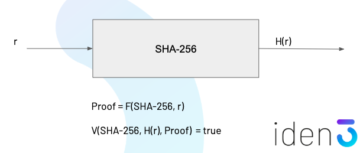

# Zero-knowledge proofs in identity systems
by Jordi Baylina &lt;<jordi@iden3.io>&gt; and David Suarez &lt;<david@iden3.io>&gt;

Privacy is key to identity systems, and Zero-knowledge proofs (ZKP) are core to maintain confidentiality over user data, but still being able to transact by receiving claims and proving these to a third party. 

## Model of a ZKP

A ZKP can be described as a deterministic program (from now circuit) where there is a private input (secret) and a public output. Such a system is able to generate a proof of the private input which is a function of the private input itself and the circuit.

Which these variables a pairing function can be constructed such as depending on the circuit, the output and the proof (but still not the private input), a validation can be performed in terms of true or false, conforming the ZKP.

### Example 

We could illustrate that in an example, based on SHA-256 hashing of a private input `r`. We know the circuit (SHA-256) and also the calculated output `H(r)`. 

A proof can be constructed over these two signals such as `Proof = F(SHA-256, r)` and the pairing function would check the validity of the proof if `V(SHA-256, H(r), Proof)  = true`.

