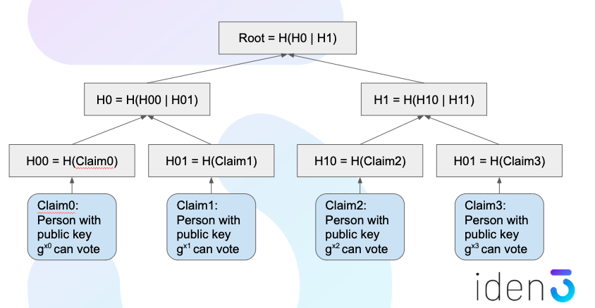
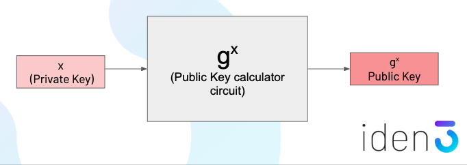
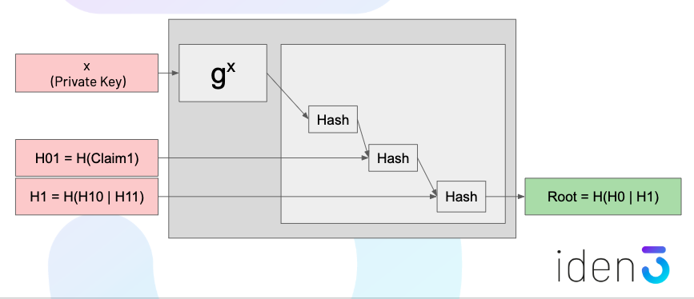
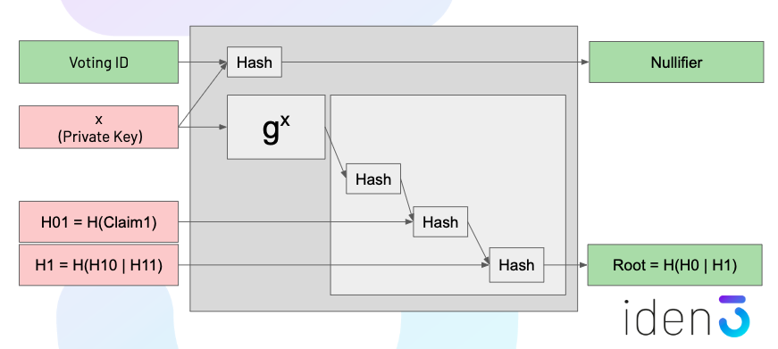

# Zero-knowledge proofs in identity systems
by Jordi Baylina &lt;<jordi@iden3.io>&gt; and David Suarez &lt;<david@iden3.io>&gt;

Privacy is key to identity systems, and Zero-knowledge proofs (ZKP) are core to maintain confidentiality over user data, but still being able to transact by receiving claims and proving these to a third party. 

## Model of a ZKP

A ZKP can be described as a deterministic program (from now circuit) where there is a private input (secret) and a public output. Such a system is able to generate a proof of the private input which is a function of the private input itself and the circuit.

Which these variables a pairing function can be constructed such as depending on the circuit, the output and the proof (but still not the private input), a validation can be performed in terms of true or false, conforming the ZKP.

### Example 

We could illustrate that in an example, based on SHA-256 hashing of a private input `r`. We know the circuit (SHA-256) and also the calculated output `H(r)`. 

A proof can be constructed over these two signals such as `Proof = F(SHA-256, r)` and the pairing function would check the validity of the proof if `V(SHA-256, H(r), Proof)  = true`.

## Merkle tree structures

Merkle trees are the fundamental data structure for the iden3 technology to store and validate the claims for each identity. The dependencies and the hierarchy model allows to generate proofs in a very efficient way.  

For example, in a votation use case, we could have a merkle tree like this one:

In the leafs of the merkle tree there is the claim for each user enabling to participate in the votation, and the middle levels of the tree (and the root) are hashes of the combined data of the tree at the lower level. So, a proof for a single user can be calculated from the specific claim and the corresponding siblings (which are the hashes of the tree needed for the upwards recalculation of the tree) of the merkle tree such as that:

## Proof validator circuit

So, in the ZKP model previuosly described, we could be able to design such a circuit which recreates the calculation model of the root of a merkle tree to verify the received proofs by recalculating the root of the merkle tree. This root will be written in the public Ethereum blockchain so it can be compared and the proof considered as valid.

To illustrate this validator abstraction, let's take the basic part with the circuit that generates a public key of an identity (which is known) from the private key (which is not known):

This circuit can be included into a more complex one where the whole merkle tree is calculated to verify the proof and to check if a specific identity belongs to a census and so is enabled to vote. 

In this scenario, it might be necessary to control that each identity can only vote once, so an additional calculation can be included which the application of voting is able to register if a unique identity has been participating before but not having to store any identifier which can be associated with the identity. This is a *nullifier* function. 

