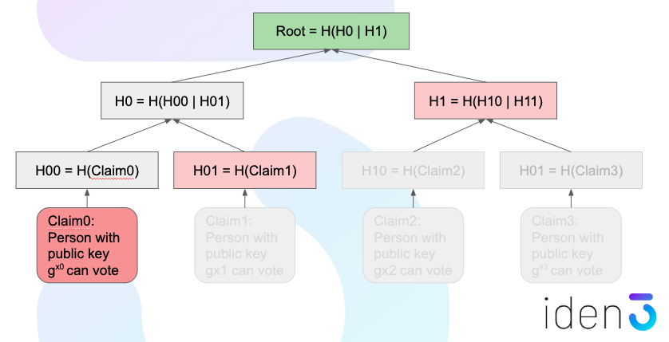
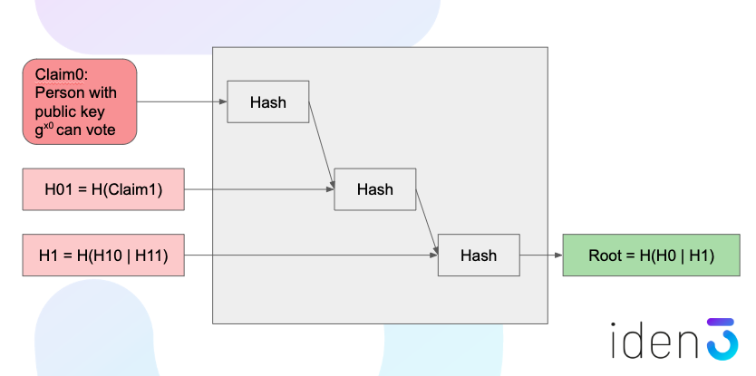
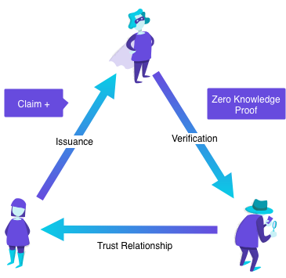
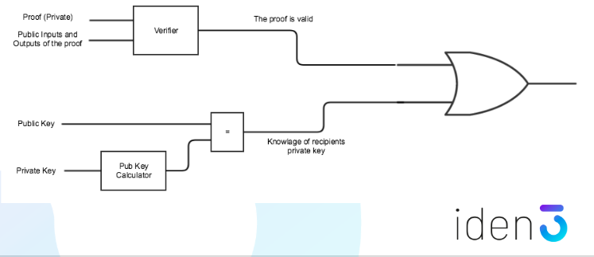

# Zero-knowledge proofs in identity systems
by Jordi Baylina &lt;<jordi@iden3.io>&gt; and David Suarez &lt;<david@iden3.io>&gt;

Privacy is key to identity systems, and Zero-knowledge proofs (ZKP) are core to maintain confidentiality over user data, but still being able to transact by receiving claims and proving these to a third party. 

## Model of a ZKP

We start with the description of a model of as a deterministic program or logic circuit (from now circuit) where there is a private input (secret) and a public output. Such a system is able to generate a proof of the private input which is a function of the private input itself and the circuit.

Using these variables, a verification function can be constructed such as depending on the circuit, the output and the proof (but still not the private input), a validation can be performed in terms of true or false, conforming the ZKP schema.

### Example 

We could illustrate that in an example, based on SHA-256 hashing of a private input `r`. We can proof that we know the `r` that matches a given without revealing it.

A proof can be constructed over these two signals such as `Proof = F(SHA-256, r)` and the verification function would check the validity of the proof if `V(SHA-256, H(r), Proof)  = true`.

## Merkle tree structures

Merkle trees are the fundamental data structure for the iden3 technology to store and validate the claims for each identity. The dependencies and the hierarchy model allows to generate proofs in a very efficient way.  

For example, in a votation use case, we could have a merkle tree like this one:

## Merkle proof

In the leafs of the merkle tree there is the claim for each user enabling to participate in the votation, and the middle levels of the tree (and the root) are hashes of the combined data of the tree at the lower level. So, a proof for a single user can be generated from the specific claim and the corresponding siblings (which are the nodes of the tree needed for the upwards recalculation of the tree) of the merkle tree such as that:

## Proof validator circuit

So, in the ZKP model previuosly described, we could be able to design such a circuit which recreates the calculation model of the root of a merkle tree to verify the received proofs by recalculating the root of the merkle tree. This root will be written in the public Ethereum blockchain so it can be compared and the proof considered as valid.

To illustrate this validator abstraction, let's take the basic part with the circuit that generates a public key of an identity (which is known) from the private key (which is not known):

This circuit can be included into a more complex one where the whole merkle tree is calculated to verify the proof and to check if a specific identity belongs to a census and so is enabled to vote. 

In this scenario, it might be necessary to control that each identity can only vote once, so an additional calculation can be included which the application of voting is able to register if a unique identity has been participating before but not having to store any identifier which can be associated with the identity. This is a *nullifier* function. 

## 3-party of claim issuance, validation and ZKP

The three party model (identity, claim issuer and verifier) in combination with ZKP is the core of privacy of identity attestations since a user can answer to any requirement as long as the claim exists and there is a trust relationship between the verifier and the issuer. 

And the most important thing, no information is revealed in this process. The user is providing *compliance* proofs which are enough for the validator to be accepted.

## Non-reusable proofs

In addition to the 3-party model, since the proofs include some kind of information of validation, it's important that the proofs generated for a verifier identity are not reusable to another identity and so maintain privacy for the users. 

This mecanism is implemented with a specific circuit that gives validity of the proof to the original recipient but invalidates the proof if this identity would try to forward it, because the proof is only valid if the sender does not know the private key of the validator.
Since the initial recipient knows his own private key, this proof is not valid to be forwarded.

