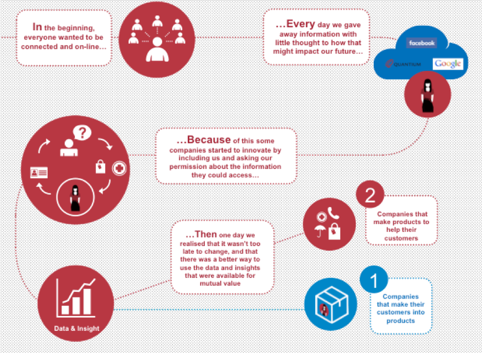
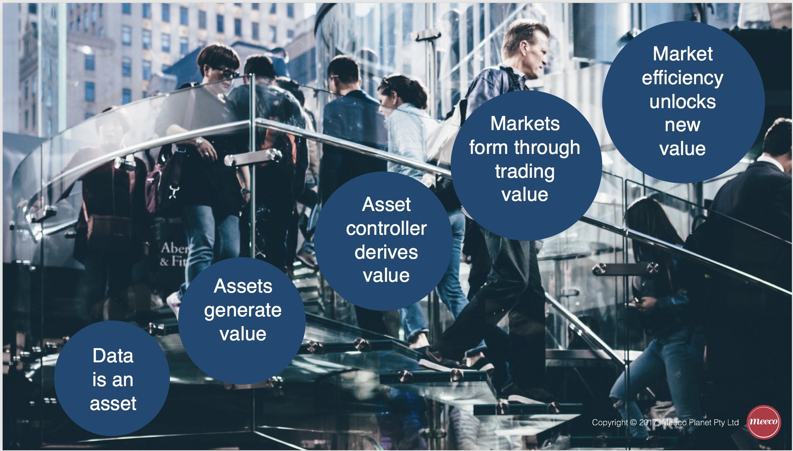

# Data Value Realisation: Control, Commons & Ownership
### by Katryna Dow

_Up until now the power to capture, analyse and profit from personal data has resided with business, government and social networks. 
What if you and I had the same power?_
 - Meeco Manifesto, 2012

## Introduction

As our lives become ever more digital, we are faced with new challenges around the economic models, methods of service delivery and how to equitably distribute the exchange of value. 

As the amount of data we generate and share accumulates, it tells a rich story through the generation of a “digital twin”. Access to follow, track and interrogate this digital twin is of increasing value to interested parties. Unfortunately, it also leaves individuals vulnerable to cyber threats such as identity theft.

Increasingly, we are faced with solving data and identity issues to support a dual physical and digital existence. Data about an individual (data subject) may even be generated prior to physical birth and continue to be generated after physical death. Therefore, the methods of access, control, delegation and consent are foundational to the legal, commercial and technological rights of data subjects. This is also the specific area of solutions focus for Meeco.

In a 2017 publication, industry thought-leaders collaborated to define the need to address the asymmetry of the “free data” market and look towards a model whereby individuals could be compensated for generating the data that fuels the current centralised, ad-driven, commercial models (Ibarra et. al., 2017). The authors assert that “the internet economy largely began with a venture-capital fuelled bubble that chased usage with little sense for a business model” (Ibarra et. al., 2017).

Since data is becoming a key measure of whether a company will remain relevant through the digital revolution (Opher et. al., 2016), new approaches and business models are required to meet the needs of the changing marketplace (Opher et. al., 2016). To address these increasing data value issues, a number of data-value models and frameworks are emerging, including:

1.	Data as Labor
2.	Data as Property
3.	Data Commons
4.	Open Data

This paper explores the aforementioned frameworks in the context of the emerging human-centred data economy.

## The Evolution of Data Sharing 

The evolution of data sharing has resulted in a common observation; “if it is free, then you’re the product”. 

Companies such as Microsoft and Apple are making public arguments in a bid to be positioned on the right side of history, advocating for the introduction of ethical data practices through to acknowledging the data rights of customers through open source or user-controlled technologies, such as the Microsoft Decentralised Identity project (2018).

Figure 1. (below) demonstrates the two predominate business models that have emerged through data collection over the past two decades.  These commercial practices have positioned companies to either make products and services that help customers, or deliver services as a mechanism to make their customers into the product. 

Data subjects are becoming increasingly aware of the implications of sharing their data.  Future proof organisations will be those that succeed to gain and maintain the confidence and trust of their customers.  

A possible model described by Experian in 2017, was the promise of better value services that are not only secure but easier to consume as a result of customers sharing their data. 

However, if the value exchange is neither lawful or equitable, then this promise is unlikely to result in better outcomes across health, education, travel and financial services. Conversely, if the right security, privacy and economic models can emerge, the potential for personalised services and expediential growth will fuel the next generation of digital services.

Companies who make their customers into the product have been labelled in a category known as “Surveillance Capitalism”. 

The rise of this phenomenon has been documented by Shoshana Zuboff in her recently published book; The Age of Surveillance Capitalism. 

It describes the use of data to derive a “behavioural futures markets,” where predictions about our behaviour are bought and sold to the highest bidder. 

Zuboff affirms that society is at a critical point in history where our decisions regarding how we use technology, under what terms and who the beneficiaries are, will largely define the rest of the twenty-first century (Zuboff, 2019)

> __Figure 1: Evolution of business models resulting from data sharing. 1. Companies that make their customers into products. 2. Companies that make products to help their customers (© Meeco, 2015)__

## Data Regulation

Over the past 12 months, regulatory regimes have begun to address the rights of access, portability and control.  Some of this regulation has been passed to specifically address the asymmetry and power of surveillance capitalism. 

The regulation is also trying to provide recourse in parallel to the rapid development and deployment of technologies such as artificial intelligence (AI) inclusive of the data required for training AI.  Some of the key regulatory and legal mechanisms include:

*	The General Data Protection Regulation (GDPR) – Europe, May 2018
*	Payment Services Directive 2 (PSD2) – European Union, 13th January 2018
*	Open Banking (European Union & UK - 13th January 2018, Australia -1st February 2020)
*	Personal Information Protection Act (PIPA) – Japan (30th May 2017)
*	California Consumer Privacy Act (28th June 2018)

The primary objective of these regulatory changes is to address the asymmetry of power exercised by centralised data controllers. More often these are multinational social networks, e-commerce platforms and multinational enterprises.

The aim is to protect the rights of individuals in step with the development of technology. However, it is evident that the rate of technology evolution is moving much faster than the ability for regulators to keep pace. As a result, regulation alone won’t bring the necessary changes for a more equitable data economy.

## The Data Economy

In 2012 when Meeco was founded, the preliminary research projects focussed on the value of data. Key lines of enquiry included questions such as:

*	Can data actually be owned, or does the nature of it mean there are always multiple parties of interest, e.g. data creator,   subject, observer, issuer etc?

*	Is data control a more likely mechanism to derive value than ownership?

*	What could be enabled at an individual, family or community group through data consolidation and collective control?

*	How might society at large; government and commercial ventures create net additional benefit for through data control         mechanisms, such as data commons, trusts or mutual benefit structures?

*	What would be the potential benefits to society and who be the beneficiaries? 

Reports published by the World Economic Forum painted a picture of an emerging data and identity economy, with the promise of increased agency if trust, transparency and fair value could be established. 

## New Models for the Realisation of Value 

Regardless of the mechanisms for regulation or technology acceptance, there are some basic fundamentals that drive the creation and realisation of value. These are consistent in society and have been applied to property, financial instruments, gold, art and intellectual property protected artefacts such as music and literature.  

The question is whether this can now be can be applied to data, such that the data subject is able to achieve fair value for participation in the data economy. In a 2015 article on emerging data rights, Katryna Dow described these universal value mechanisms applied to data as follows:

1.	Data is an asset 

2.	Assets generate value

3.	Whoever controls the asset derives the value

4.	Markets are built on trading and exchanging value to the advantage of the controller

5.	Individuals generate data (assets) but don’t have mechanisms to participate in the value chain, therefore control of the       asset needs to lawfully shift to the individual in order for that value to be realised by the individual

6.	Mechanisms for individuals to achieve this would be required to enable individuals to be part of the value chain

7.	Being part of the value chain creates parity and parity leads to flatter structures and cost reduction, giving rise to         peer-2-peer services and the potential to remove intermediaries

8.	Cost reduction creates new forms of value available for distribution between the participants

9.	New forms of distribution enable new business models which drive innovation

10.	Innovation supports the evolution of society and often means the things of the past are no longer acceptable, such as the     centralised commercial control of personal data through social networks.

> __Figure 2: Data as an asset unlocks new value in the data marketplace © Meeco 2015__

## Emerging Legal and Commercial Models

Over the past decade organisations have been able to increase the value of their asset base through the collection and control of customer data, e.g. loyalty programs and big data repositories. Additionally, organisations have been able to insure data and record its value as a tangible asset to increase the value of balance sheets, stock prices and market position.  

If companies can do this, then it follows that it should only be a matter of time before the same could be true for individuals. However, without the legal, economic or technological means to derive value from data, it is unlikely that individuals will benefit directly from participating in a data marketplace. 

More so, without the acknowledgement that the ethical, legal and control mechanisms of the current connected world are not in service to humanity, we risk compounding the economic benefits exploited by relatively few actors through centralised privately held commercial and social platforms. 

Left to their own devices these platforms are increasingly removing agency in both the physical world and digital transactions. 

“Every child born in today’s digital world will live a dual physical and digital life. How we enable privacy and security for their digital twin in as important as the rights afforded to them in the physical world. Protecting their identity, enabling trusted authentication and authorisation of services is the key challenge for us to solve in an increasingly connected world. If we don’t get this right, we risk a generation born into digital slavery rather than delivering on the promise of empowerment through technology”
    -	Katryna Dow, World Government Summit, 2019

To address these increasing data value issues a number of models are emerging, including Data as Labor (DaL), Data as Property (DaP), Data Commons and Open Data.

In order to evaluate the merits of these proposed frameworks, it’s important to understand the underlying ethos and where they draw on or seek to apply existing legal statues. 

## Data as Labor

The prevailing model of treating personal data is essentially a barter system – consumers enjoy free services in exchange for their data, which is gathered by service providers at no charge. This model is called Data as Capital (DaC). An alternative offered is DaL (Ibarra et. al., 2017). This offers incentives to consumers to contribute data. DaL would provide benefits such as

*	Increased quality and quantity of user data, especially in the context of AI and Machine Learning, which requires large       amounts of different data

*	Curbing the activity of trans-national companies as sole “buyers” of user data, and the creation of a fair and vibrant         market for data labor

*	Increased engagement in their own data by individuals, and creation of “digital dignity” even to the point of assisting       Machine Learning in tackling sophisticated tasks, with commensurate reward

While pointing out that DaC and DaL can cohabit in the market, the authors acknowledge the difficulties in creating this new “Radical Market” and data economy. They include:

*	The necessity of enlisting very large organisations in the change. There are different business models among the large         commercial data players (Facebook and Google are most reliant on DaC), but all have relatively stable, profitable          `   businesses. To pivot to a different form of data economy will be challenging for them, despite the appeal of access to more   and different data for use in AI and Machine Learning activities.

*	The need for users’ to participate in numbers and be prepared to bargain collectively (which implies membership of a form of   union or membership association).

Finally, governments, despite mandating significant new access to user data (e.g. GDPR), have not created labour laws that are compatible with the DaL economy.

Apart from these issues, the DaL model does not contemplate data ownership. DaL seeks to return value for users in exchange for their data; once that exchange is complete, it is commonplace that ownership of the relevant data passes to the “buyer”.

The early thinking around DaL formed the basis for Eric Posner and Glen Weyl to extend the concepts of “Radical Markets” into the publication of the book by the same tile in 2018.

Radical Markets sets out to demonstrate why private property is inherently monopolistic, and how society would all be better served if private ownership were converted into a public auction for public benefit. They show how the principle of one person, one vote inhibits democracy, suggesting instead an ingenious way for voters to effectively influence the issues that matter most to them. They argue that every citizen of a host country should benefit from immigration—not just migrants and their capitalist employers. They propose leveraging antitrust laws to liberate markets from the grip of institutional investors and creating a data labor movement to force digital monopolies to compensate people for their electronic data.

“Only by radically expanding the scope of markets can we reduce inequality, restore robust economic growth, and resolve political conflicts. But to do that, we must replace our most sacred institutions with truly free and open competition”
 	  — Radical Markets 

## Data as Property

Personal data is generated between the data subject and the data controller. This is distinct from intellectual property which is generated by the data subject (Schermer, 2015). 
As Schermer points out, this fact alone questions whether the data subject owns their personal data as they did not autonomously generate it and suggests that personal data is the opinion that a data controller holds about a person (Schermer, 2015). 

Schermer examines The Right to Be Forgotten as an application of this theory. Data subjects have a right to be forgotten, but society at large has a right to form and record an opinion about a person, for example for criminal proceedings. If personal data is treated as private property, the right to be forgotten will always win and may inhibit what is best for society (e.g. prosecuting a criminal to protect community safety).

Ritter and Mayer (2018) propose a property rules construct that clearly defines a right to own digital information arises upon creation (whether by keystroke or machine) and suggest when and how that right attaches to specific data though the exercise of technological controls. 

They tout possible benefits such as efficient adaptations of new data asset rules, and new methods for regulating and enforcing rights regarding personal information (Ritter and Mayer, 2018). 

In 2018, Elizabeth Renieris and Dazza Greenwood co-authored an article on property rights, with the title posing the question: 
“Do we really want to ‘sell’ ourselves? 
The risks of a Property law paradigm for personal data ownership

In the article the authors highlight that while “ownership implies a property law model of our data, they argue that the legal framework for identity-related data must also consider constitutional or human rights laws rather than mere property law rules.

This question speaks to the core of the issue about data ownership. Does moving from corporations trading data to individuals trading data (based on their property rights) move society forward, or risk creating a greater digital divide, and/or making privacy a luxury item out of the reach of much of the population?

More so, is the average person aware of the risks, consequences and downstream impacts of trading their data, for example possible exclusion from insurance or employment.

If data has the potential to unlock expediential value in terms of personalisation of health, education, finance and employment – access is critical, but the mechanism of trading may actually inhibit the benefits along with mitigating personal risks. 

“We must find the balance that will enable personalisation without further asymmetry in the market” 
    – Katryna Dow 2019
    
As outlined by Renieris and Greenwood, under common law, ownership in property is a collective of five rights:

1.	Of possession
2.	Control
3.	Exclusion
4.	Enjoyment
5.	Disposition 
  
Whilst title ownership of real property or goods relates to the evidence of a form of deed, bill of lading, receipt – essentially proof of commercial transaction or purchase. Also, property rights are granted and as such enable property or goods to be transferred moving ownership and control to another party.

However, as more and more our digital twins are a mirror for our physical selves, the issue of our fundamental and (existing) human rights are also bound with the notion of privacy, security and rights to protect oneself and be kept from societal harm.
Essentially it will not serve humanity or society if people need to “sell” parts of their digital self for commercial gain – in the same way the law does not permit people to sell body parts. 

Which leaves us with the tension between the protections afforded by control, e.g. exclusion and enjoyment (imagine if you could limit what Facebook does with your data) and at the same time, property law in its entirety doesn’t account for the phenomenon that data is and exoskeleton (location, action, device) virtual layer around our physical self, and therefore requires protections akin to our physical self.

## Data Commons

Whilst Data commons is not a new concept, it is beginning to gain more attention as the issues of regulation and ownership are debated. Taking a ‘Commons’ approach has proved to enable other disciplines, e.g. Creative Commons to flourish with fair use and acknowledgment of contributors for the collective good.

Critical to a Commons approach is the clarity of purpose, use and application. For data this is particularly challenging because there exists the:

*	data created by individuals (data subject)
*	data that is created about the data created (metadata)
*	data the observer creates about what the data subject created or is derived, enhanced or used from the metadata or data processing. 

And so, it goes, on between the data subject (or creator) and the observer, collector, processor etc. More often there is more than one party of interest or desired control in any data created. A current example is the data created on social networks. Whilst data subjects may have the “rights” to request data created (posts, media, comments), many networks consider the meta-data, insights and inferences to belong to the processor and not the subject.

Data Commons provides a framework of co-locating data and data resources and sharing data to create an interoperable resource for the wider community to access in order to conduct research (for example, Genomic Data Commons).

Frame works for alternative business models should be tested based on the principles of the commons (Vercellone et. al., 2018). 

Christopher Allen (2015) summarises the principles of the commons in the following 10 points:

1.	Define Boundaries: There are clearly defined boundaries around the common resources of a system from the larger               environment.

2.	Define Legitimate Users: There is a clearly defined community of legitimate user of those resources.

3.	Adapt Locally: Rule for use of resources are adapted to local needs and conditions.

4.	Decide Inclusively: Those using resources are included in decision making.

5.	Monitor Effectively: There exists effective monitoring of the system by accountable monitors.

6.	Share Knowledge: All parties share knowledge of local conditions of the system.

7.	Hold Accountable: Have graduated sanctions for those who violate community rules.

8.	Offer Mediation: Offer cheap and easy access to conflict resolution.

9.	Govern Locally: Community self-determination is recognised by higher level authorities.

10.	Don’t Externalise Costs: Resource systems embedded in other resource 		systems are organised in and accountable to           multiple layers of nested 	communities.

Whilst there are many benefits made possible through a Commons approach, the rights of value derived from control of a data asset are not as clear and open to exploitation by entities that have the means to do so.

## Open Data

Open data is the theory that data should be readily available to the public to access, analyse and republish as they wish, without restrictions from copyright, patents or other mechanisms of control (Open Data Institute).

For the purpose of this paper, it is to be assumed that data such as weather, pollution, traffic flows, transportation, town-planning and health warnings must stay open in the interest of the greater good. 

However, the ability for a data subject to combine their own personal data (PII) with open data and social data, results in an amplified data set where more context and intent may be derived, thus increasing the value of the data. 

The ability to bring personal, proprietary and open data together provides a significant advantage for organisation with the computing power to industrialise this, e.g. Facebook. It is for this reason that the German antitrust watchdog has just launched a legal challenge to order Facebook to stop gathering data from source outside the platform and using the data to track people who are not member or users of Facebook.

Conversely there are emerging projects, such as DEcentralised Citizens Owned Data Ecosystem (DECODE) in Spain, whose aim is to provide rights above GDPR in response to people’s concerns about a loss of control over their personal information on the internet (Vercellone et. al., 2018). 

DECODE aims to build a data-centric digital economy where data that is generated and gathered by citizens, the Internet of Things (IoT), and sensor networks can be available for broader communal use, with appropriate privacy protections. 
Outcomes will demonstrate the wider social value that comes with individuals being given the power to take control of their personal data and given the means to share their data on their terms (Vercellone et. al., 2018). 

## The Argument Against Data Rights

Despite the range of emerging frameworks, there are also strong arguments against the rights of data subjects, in particular for use-cases that benefit the common good, such as; the collection of census, pollution, voting, health and transport data. These data sets are vital to planning critical infrastructure such as hospitals, schools, places of worship, airports and managing environmental impact.

Modelling longevity, rates of disease, increase in population and mortality trends are increasing important as we are both living longer and the population size of the ageing “Baby Boomer” generation. 

Whilst ever commercial actors with centralised data control power can justify the cost of regulatory fines, it is easier for them to continue with existing data practices and build fines into the cost of sale, therefore there is motivation to campaign against individual data rights.

Under changes such as Open Banking, it’s likely financial intuitions will argue for the minimum compliance in order to protect what they consider as “owning the customer”. Conversely, neo banks and early adopters may take the lead in providing increased customer utility and better customer experiences by embracing more open and inclusive data eco-systems.

## CONCLUSION

In summary many of these concepts have merit; the potential to blend data as labor (for effort reward) with data as property (rights of contol and enjoyment) with data commons (fair use) together with open data (collective good) represent an ideal legally protected outcome.

Harmonising these perspectives will no doubt result in trade-offs and challenges in jurisdictions around the world. 

As we approach 2020 we are locked in debates around the application of 20th century laws and statutes to technologies that will be ubiquitous over the next 20-100 years. In many ways this is like trying to regulate how to put an engine in a horse rather than accept that the paradigm has completely changed.

Historically, we have seen once accepted behaviours such a not wearing a seat-belt, smoking on aircrafts, or denying the right to vote as dangerous and archaic. Laws and norms have evolved to make these practices unlawful. 

It is our opinion that we will see the same evolution of rights with respect to the lawful access, control, delegation and consent of personal data. 

However, without a clear legal framework inclusive of liability and recourse, it will continue to be difficult to develop new commercial models and methods of value which can drive the adoption of trusted data marketplaces.

This is why open standards, decentralised solutions and interoperability of personal data exchange mechanisms are vital to maintaining a free and democratic society; one that can harness the power of data for both the individual and collective good.

## References

Allen C., (2015) 10 Design Principles for Governing the Commons. Available: http://www.lifewithalacrity.com/2015/03/10-design-principles-for-governing-the-commons.html

Allen C., “Self-Sovereign Identity Principles 1.0,” GitHub, 23 October 2016. [Online]. Available: https://github.com/ChristopherA/self-sovereign-identity/blob/master/self-sovereign-identity- principles.md. [Accessed 13 May 2018].

DECODE - DEcentralised Citizens Owned Data Ecosystem, Spain
https://decodeproject.eu

Dow K., “Meeco Manifesto” 2012
https://meeco.me/manifesto.html

Dow K., Seat Belts – Cigarettes - Data Blog (October 2015)
https://katrynadow.me/seat-belts-cigarettes-data/#more-303

Haslingden R., (2017) Open Banking – Creating a New Era of Data Sharing.
Experian. Available: https://www.experian.co.uk/assets/resources/white-papers/open-banking-whitepaper-2017.pdf

Ibarra I. A., Goff L., Hernández D. J., Laier J., Weyl E. G., (2017) Should We Treat Data as Labor? Moving Beyond “Free” American Economic Association Papers & Proceedings, Vol 1 (1).

Facebook – Germany Antitrust Watchdog to Act Against Facebook
https://www.reuters.com/article/us-facebook-germany-antitrust/german-antitrust-watchdog-to-act-against-facebook-report-idUSKCN1P70KO

Microsoft: Decentralised Identity – Own and Control Your Identity
https://query.prod.cms.rt.microsoft.com/cms/api/am/binary/RE2DjfY

Opher A., Chou A., Onda A., and Sounderrajan K., (2016) The Rise of the Data Economy: Driving Value through Internet of Things Data Monetization. IBM. Available: https://www.ibm.com/downloads/cas/4JROLDQ7 accessed 21 February 2019.

Posner E. A., and Weyl E. G., (2018) Radical Markets. Uprooting Capitalism and Democracy for a Just Society. Princeton University Press. 

Renieris E. M. and Greenwood D., (2018) Do we really want to “sell” ourselves?
https://medium.com/@hackylawyER/do-we-really-want-to-sell-ourselves-the-risks-of-a-property-law-paradigm-for-data-ownership-b217e42edffa

Ritter J., and Mayer A., (2018) Regulating Data as Property: A New Construct for Moving Forward, 16 Duke Law & Technology Review 220-277

Schermer B., (2015). Privacy and property: do you really own your personal data? Universiteit Leiden Law Blog. Available: https://leidenlawblog.nl/articles/privacy-and-property-do-you-really-own-your-personal-data

Vercellone C., Brancaccio F., Giuliani A., Puletti F., Rocchi G., and Vattimo P., (2018) DEcentralised Citizens Owned Data Ecosystem (DECODE) D2.4 Data driven disruptive commons-based models. 

Zuboff S., (2019) The Age of Surveillance Capitalism. The Fight for the Future at the New Frontier of Power, Allen & Unwin. Forthcoming.

