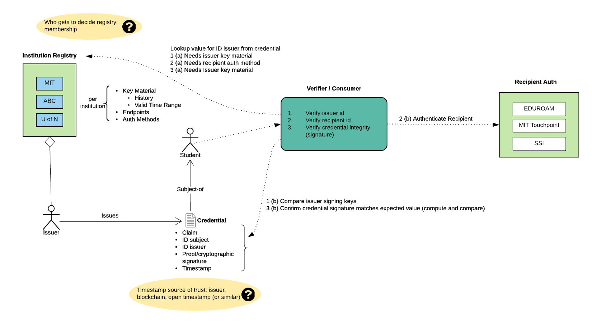

# Designing a Recipient-Centric Educational Digital Credential Ecosystem

## Draft: Rebooting Web of Trust VIII Topic Paper

 by Kim Hamilton Duffy, J. Philipp Schmidt, Joe Andrieu

# Abstract

This paper originated from an exercise to design a digital credentialing ecosystem for universities (as an original target implementation) from first principles -- without assuming specific technology choices or standards. Consistent with the goals of self-sovereign identity (SSI), we wanted this system to be recipient-centric. This included enhanced privacy measures, minimizing issuer-dependencies in use of the credentials, and ease of use. To do this, we outlined the minimal set of requirements, as well as simplifying assumptions for the target deployment.

One goal of this exercise was to understand whether (1) certain emerging SSI standards -- including Verifiable Credentials (VCs), Decentralized Identifiers (DIDs) -- and (2) blockchain anchoring are essential to the simplified digital verifiable credentialing system. If so, we wanted to trace them to specific requirements.

An additional goal was defining a threat model, to understand which aspects could be handled by the system, and which must be addressed by other systems. 

In the end, the design we produced did incorporate VCs and DIDs: VCs because of the lightweight framework and interoperability they enable, and DIDs for providing a flexible auth framework. Details about this decision are included in this paper. 

This exercise highlighted that one of the threats in our model -- that of detecting a malicious party within the issuer organization -- forced specific implementation choices, some of which could be mitigated through trusted timestamping and blockchain technologies. The threat could also be mitigated/detected outside this minimal system -- for example through a SaaS product providing additional audit logs -- but that system must similarly take measures to prevent or detect malicious actors/agents (even outside the issuing organization).

Our concern is that an effective digital credentialing ecosystem would make fraud within an issuing organization more appealing, so our final goal of this paper is to raise awareness among the broader SSI community.

_Note on terminology: we use the term "recipient" below as that's widely used in this domain. It means holder/subject._

# Requirements

The credentialing system has the following minimal set of requirements:

*   An issuance should require the consent of both the issuer and recipient
*   A recipient should be able to prove the credential was issued by the issuer without requiring interaction with the issuer
*   The system should minimize the risk of recipient correlation, for example:
    *   Avoid subject (recipient) identifier (DID) reuse
    *   Incorporate nonces/recipient signatures (to avoid matching on hashed or signed values)
*   The recipient should be involved in the verification process
    *   From Verifiable Credential Data Model: "[Holders](https://w3c.github.io/vc-data-model/#dfn-holders) are positioned between [issuers](https://w3c.github.io/vc-data-model/#dfn-issuers) and [verifiers](https://w3c.github.io/vc-data-model/#dfn-verifier) and use [verifiable credentials](https://w3c.github.io/vc-data-model/#dfn-verifiable-credentials) to make [verifiable presentations](https://w3c.github.io/vc-data-model/#dfn-verifiable-presentations) to [verifiers](https://w3c.github.io/vc-data-model/#dfn-verifier)."
    *   A side effect is that the recipient can not be forced to present a revoked credential
*   The issuer should be able to revoke the credential
    *   It's TBD wether recipient revocation is a requirement. As described above, the Verifiable Credentials interaction model puts the recipient in the verification process, so the recipient can't be forced to present a credential they disavow
    *   Anti-correlation and other privacy measures help ensure they can't be linked to the credential
    *   But we are concerned this may assume the existence of recipient agent infrastructure
    *   TBD whether encryption is essential, but it will be desired in many cases
*   Once revoked, a credential must not return as "verified" by a confirming verification process. However, the system must enable proof that the credential was once valid one for some time period
*   Revoking and changing signing keys (issuer or recipient) should not invalidate previously-issued valid credentials
*   Revocation check should not reveal any personally identifiable information (or any additional information about that credential or batch)

Beyond this minimal list of functional requirements, we plan to update this with policy-level considerations -- such as environmental sustainability.

We expect to extend/refine this list of requirements, but our guiding heuristic is the solution must be "better than paper". Specifically, in the process of improving efficiency, portability, and interoperability, we must not threaten privacy and control of the individual in the process. In fact; ideally privacy measures and control of the individual will strictly improve. This goal requires more elaboration in the list of requirements.

# Designing the system from first principles

## Use cases

Issuer issues educational credentials (degrees, microcredentials, transcripts) to students. Organizations within the system and outside (most critically) want to be able to verify the recipient's credentials without directly consulting the issuing institution. This is relevant, for example, when the recipient wants to apply for a job, graduate school, etc.

Consumers/Relying parties not only want to verify the credential; they want to authenticate the recipient corresponds to the subject of the credential. 

## Simplifying Assumptions

Let's make the following simplifying initial assumptions (later we'll address moving to more complex scenarios -- or even whether these assumptions are needed) for the digital credentialing system:

*   Limited set of institutions initially
*   Those institutions are trusted to maintain a registry that contains a mapping of institution names to key material
*   Verifiers/Consumers/Relying parties trust the registry and know to consult it when presented with the credential

## Derived requirements

To enable verification that does not involve the issuer, the registry must be highly available and allow lookup of valid issuer keys for a given time range.

Issuers want to permit different auth methods, therefore the registry must tell relying parties how to authenticate recipients/subjects (i.e. confirm they are the recipient of the credential).

## Why Verifiable Credentials

We wanted the credentials to have the privacy/security requirements listed in the first section. In addition, we wanted the content to be flexible and determined by the issuer. We wanted these to have a common interoperable structure that was lightweight.

This discussion was brief; we simply found no better alternative to Verifiable Credentials.

## Why DIDs

The primary advantage of DIDs (for issuers and recipients) was to maintain flexibility for issuers' different identity providers and auth mechanisms. Among issuers, there may be a preference for existing system like EDUROAM or Touchpoint, but:

1.  These are not guaranteed to be usable by the student after graduation
1.  Some may prefer to use X.509 associated with domains

Using DIDs enables a variety of solutions, and SSI approaches for users who choose that route.

# Threat model

## Must handle

The system should handle the following threats:

*   A recipient lies about the content of a credential they received 
*   A recipient lies about the existence of a (not existing) credential
*   A recipient tampers with the display of the credential they received

## Unknown

Ideally the system should handle these threats, but this forces certain implementation choices. These will be elaborated on in the "Analysis" section:

*   Issuer cannot lie about date of issue
*   Malicious actors inside valid issuer institution issues credentials that should not exist

### Issuance Date

To clarify, the date of issue this may differ from the date of award. The issuing institution must be able to backdate awards recieved in the past. The problem here is whether the issuance date timestamp stated by the issuer in the credential can be trusted. 

Trusted timestamping can be used to support issuer claims of issuance date (or replace). This can be accomplished by a range of methods including TSAs, blockchain anchoring, and Open Timestamps. 

At the same time, the current VC threat model does not call out this threat, which is why we raise this here.

### Fraudulent issuance detection

This threat involves a bad actor in the issuing institution, who is able to sign with the issuing address, that is issuing fraudulent credentials to friends/collaborators. Does a verification process that cuts out the issuer increase this risk?

One benefit of blockchain-anchoring is that one can alert on issuer addresses to detect suspicious issuances. However, if batch issuance is used, (and the issuer is not involved in verification), it may not be possible to detect fraudulent entries without additional metadata or an audit trail of the batch recipients (e.g. if the issuer records who is expected in the batch, and can deterministically reproduce the batch, they can verify that the merkle root matches what's recorded on chain).

Which level of the credential issuance solution should handle this threat? And do VC threat models call proper attention to this risk?

While this can be solved on a case-by-case basis, we think this problem needs broader awareness. 

## Out of scope

*   The system does not prevent illegitimate issuing organizations, e.g. "Fake University of North South Idaho". Other existing mechanisms exist to police them, e.g. accreditation bodies, federal funding guidelines, etc...
*   The system cannot determine whether a backdated credential is valid (e.g. it must allow generation of proof for an individual that graduated 5 years ago)
*   The system cannot determine exact time of issuance; it can only determine the (approx) time of issuance via "trusted" timestamps (blockchain anchoring and open timestamps)

## In-scope threats, by actor

*   Issuer
    *   Malicious issuer may revoke a credential, but observers can see it was once valid
    *   Malicious issuer may fraudulently issue a credential, but the issuance should be detectable (auditable)
*   Recipient
    *   Malicious recipient may obtain a fake credential, but the issuance should be detectable (auditable)

# Analysis and Next Steps

The biggest concern this exercise revealed is that of detecting a malicious party in the issuing organization. It's straightforward to mitigate/detect this problem as part of a broader system deployment, e.g. audit logs in a SaaS product. But that system must similarly take measures to prevent or detect malicious actors/agents. So this is just a special case of a broader set of fraudulent issuance concerns. 

Solutions may involve a range of tactics in a deployed system, including:
- Audit logs
- Address monitoring (if blockchain-anchored)
- Improved credential provenance measures (described below)

To be clear, many deployed credentialing systems do provide such auditing measures, to at least detect fraud and revoke suspect credentials. But are we addressing this in similar ways? What advice and best practices can we pass on to the VC community? 

On review of these concerns, Joe Andrieu pointed out that the best (and perhaps only) approach is going to be better provenance of the certificate, which leads to "turtles all the way down" but which provides the best route to a superiority of information about the credential. This was not covered in our system model, and deserves a closer look.
 \
In this model, the credential would not just say "created and signed by MIT", but probably also the human actor that triggered the credential creation and signature, their authority to do so on MIT's behalf, and potentially even the system on which it occurred and the version of software used, etc. There's a delegation happening here, which is an issue similar to why bug reports need to know the user's OS, browser, and versions of both. Unless you characterize the system used to generate the credential, you only have the trust in key management of the issuing entity for evaluating the quality of the credential. \
 \
It's fairly banal attack for a trojan horse that wraps itself around the signing app to get inside the signing machine and generate false signatures. The user unwittingly uses the trojan horse instead of the real application, including the authentication into the private keys. This is why some of the IoT credential assurance procedures require using a machine that has never been and never will be on the network--only an isolated device meets the standard. \
 \
The current set of requirements outlined in this paper do not address this kind of provenance, extending to the need to check the status of such delegation relative to the time of issuance. The latter originates from the system requirement is to allow an institution to revoke a person's ability to generate valid credentials without revoking credentials properly issued by that same person. \
 \
The added provenance also allows verifiers to spot known compromised software packages and request the holder get a fresh credential. \

We'd like to get community feedback on this topic, so we can share detection/mitigation approaches, and improve our guidance and best practices around credentialing ecosystems.

# References

*   Verifiable Credentials Use Case and Requirements: https://w3c.github.io/vc-data-model/#use-cases-and-requirements
*   Blockcerts Roadmap: [https://github.com/WebOfTrustInfo/rwot7/blob/master/topics-and-advance-readings/blockcerts_roadmap.md](https://github.com/WebOfTrustInfo/rwot7/blob/master/topics-and-advance-readings/blockcerts_roadmap.md)
*   VC Data Model: [https://w3c.github.io/vc-data-model/](https://w3c.github.io/vc-data-model/)
*   VC Data Model Explainer: [https://github.com/w3c/vc-data-model/blob/gh-pages/VCDMExplainer.md](https://github.com/w3c/vc-data-model/blob/gh-pages/VCDMExplainer.md)
*   DID Primer: [https://github.com/WebOfTrustInfo/rwot5-boston/blob/master/topics-and-advance-readings/did-primer.md](https://github.com/WebOfTrustInfo/rwot5-boston/blob/master/topics-and-advance-readings/did-primer.md)

<!-- Docs to Markdown version 1.0β14 -->
