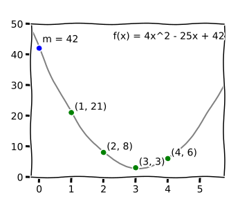

# Implementing threshold schemes

## Author

Daan Sprenkels `<hello@dsprenkels.com>`

## Abstract

"Shamir secret sharing is a method to split secrets into shares, and to later recombine them. However, it does not feature integrity protection of the secret. This article elaborates on Feldman VSS and Pederson VSS, which *do* protect the message integrity. Furthermore, we show how hashing the shares also protects the message integrity, but is vulnerable to a cheating dealer.

> Markdown does not really support footnotes. In this document, I use blockquotes for this purpose.

> A couple of weeks ago, Christopher Allen requested me to "summarize [my] post https://dsprenkels.com/sss-34c3.html" and submit it to the [RWOT8 repo][rwot8].

## 1. Introduction

Threshold schemes are cryptographic schemes that allow a group of people to split a secret message $m$ up in a set of different *shares* $s_i$. These shares can later be used to recombine the shares into the original message.

A prominent detail of threshold schemes is that the *dealer* can specify the *threshold* of the amount shares that needs to be reached for the message to be recombined. For instance, they can split a message into 5 shares, but allow the message to be recovered if only 4 shares are recombined. Should one share be lost by any of the participants, then the message can still be recovered.

In this article, I will try to set forth a general description on Shamir's secret sharing scheme in Section 2, and the two verifiable secret sharing schemes from Feldman and Pederson in Section 2. In Section 4 I will introduce a patched version of Shamir's scheme, using hash functions and analyze its security properties. In Section 5, I will briefly argue about some details that are important when choosing and implementing these kinds of schemes.

## 2. Shamir secret sharing

The first and still most relevant scheme is [Shamir's secret sharing scheme][Sha79] (SSS). The idea is quite simple. Consider the dealer has a message $m$, which they want to split into $n=5$ shares, with a recombination threshold of $t=4$.

- **Distribution.** The dealer:
    - generates a *random*  polynomial $f(x)$ of order $t$, i.e. $f(x) = a_{t-1}x^{t-1} + \ldots + a_{0}$;
    - sets the lowest order coefficient $a_0$ to $m$, s.t. $f(0) = m$;
    - evaluates $n$ points on the polynomial: $s_{1} = (1, f(1)), \ldots, s_{n} = (n, f(n))$, and distributes them among the participants.
- **Reconstruction.** The participants:
    - collect at least $t$ shares;
    - fit a polynomial $f'(x)$ between the points $s_{1}, \ldots, s_{t}$, which can be done using Lagrange interpolation; and
    - they recover $m = f'(0)$.

Essentially, in Shamir's scheme the dealer creates a system of $t$ equations that the participants have to solve to get the message back. Indeed, the recombination could also be implemented using another kind of solving algorithm, like [Gaussian Elimination]. Figure 1 shows an example of this idea.

Figure 1: In this case the dealer has their secret $m = 42$. They choose the threshold $t = 3$ and will be splitting $m$ into $n = 4$ shares. They generate the polynomial $f(x) = 4x^2 - 25x + 42$. If we plot the shares for $x = 1$ up to $x = 4$, we can see that we could fit this polynomial back from the points. To do this, we would need at least 3 points.

Shamir's scheme is---what we call in crypto---*information theoretically secure* for confidentiality. In this case, this means that the $y$-coordinates of the shares cannot be distinguished from numbers that are purely random. The consequence is that without a sufficient number of shares, the secret *can never* be recovered. No computer in the world---not even a quantum computer---has enough power to "crack" the secret.

In the previous paragraph, I explicitly mention that SSS is secure for *confidentiality*. That is because SSS is very much insecure for *integrity*. If one of the participants knows something about the actual value of the secret, they can manipulate their share to force $m$ into some value that they prefer. Therefore, one should not share any value that has to be integrity-protected in some kind of way, using only schoolbook SSS. Conversely, any participant can alter their share such that the original secret will be garbled. This will generally not be detectable by the others. Basically, when you are using schoolbook SSS, you must only share keys that are generated randomly.

> If you are interested in the details of forging shares, I refer you to an [explanation][ForgingShares] I wrote earlier on the Crypto StackExchange.

Of schoolbook SSS, we can write down some benefits and downsides.

#### Benefits

- Information-theoretical security for confidentiality.
- Needs no mathematical assumptions.

#### Downsides

- No integrity protection.
    - Thus, the dealer can cheat.

## 3. Background: verifiable secret sharing

We could quite easily patch SSS to secure the integrity of the secret, I will get back to this further in this article. However, before rolling our own crypto, I would like us to first take a brief look at the two most popular *verifiable threshold schemes*. Maybe we can take some inspiration from those, before trying to solve the integrity problem ourselves.

> Note, these descriptions come from B. [Schoenmakers' lecture notes on Cryptographic Protocols][CryptoProt19] (Chapter 6). These notes contain more in depth security analyses on these threshold schemes.

### 3.1. Feldman VSS

In, [Feldman VSS][Feldman87], let $\langle g \rangle$ be a group wherein the Diffie-Hellman assumption holds.

- **Distribution.** The dealer:
    - runs Shamir's scheme on $m$ and gets $f(x), s_{1}, \ldots, s_{n}$; and
    - computes and broadcasts commitments $B_{j} = g^{a_j}$ for $0 \le j < t$.
- **Reconstruction.** The participants:
    - each verify *all* the shares by checking whether $g^{s_i} = \prod_{j=0}^{t-1} B_j^{i^j}$; and
    - run Shamir's reconstruction protocol to recover $m$.

**Benefits:**

- DL-based security for confidentiality.
- Information-theoretical security for integrity.
- Dealer cannot cheat.

**Downsides:**

- Assumes DL assumption.
- Can only share uniformly random messages.

### 3.2. Pederson VSS

In [Pederson VSS][Ped92], let $\langle g \rangle$ be a group wherein the Diffie-Hellman assumption holds. Also, let $h$ be a random element from $\langle g \rangle$, s.t. the discrete logarithm $\log_g h$ is not known to anybody.

- **Distribution.** The dealer:
    - generates two *random*  polynomials $f_a(x),f_b(x)$ of order $t$, i.e. $f_a(x) = a_{t-1}x^{t-1} + \ldots + a_{0}$ and $f_b(x) = b_{t-1}x^{t-1} + \ldots + b_{0}$;
    - sets the lowest order coefficients $a_0,b_0$ to $m$, s.t. $f_a(0) = f_b(0) = m$;
    - evaluates $n$ points on the polynomial $s_{1} = (1, f_a(1), f_b(1)), \ldots, s_{n} = (n, f_a(n), f_b(n))$, distributes them among the participants; and
    - computes and broadcasts the commitments $C_j = g^{a_j}h^{b_j}$ for = $0 \le j < t$.
- **Reconstruction.** The participants:
    - collect at least $t$ shares;
    - fit a polynomial $f'(x)$ between the points $s_{1}, \ldots, s_{t}$, which can be done using Lagrange interpolation; and
    - they recover $m = f'(0)$.

#### Benefits

- Information theoretical security for confidentiality.
- DL-based security for integrity.
- Dealer cannot cheat.

#### Downsides

- Assumes DL assumption.

### 3.3. Observation

We see that both schemes are based on broadcasting *commitment* values. These commitments force the shares to be some kind of value, without revealing that actual value. A participant can use these commitments to verify if their share is actually correct, but from these commitments, one cannot reproduce the shares.

## 4. SSS with hashed shares

From my experiences implementing crypto, I find that correctly implementing discrete logarithm-based schemes is very difficult. We do however know another building block which we can use to build a commitment scheme, that is the *hash function*. For RWOT8, this was first proposed by Peg in his [article][Peg]:

> He says: "This is also something we considered, but feel that it gives custodians more unnecessary extra information and less accountability compared to other methods."

So, instead of committing to the polynomial coefficients, we commit to the values of the shares. I.e. we propose the following scheme:

- **Distribution.** The dealer:
    - runs Shamir's scheme on $m$ and gets $f(x), s_{1}, \ldots, s_{n}$; and
    - computes and broadcasts commitments $D_i = H(s_i)$ for $1 \le i \le n$, where $H$ is a preimage resistant hash function.
- **Reconstruction.** The participants:
    - each verify *all* the shares by checking whether $H(s_i) = D_i$; and
    - run Shamir's reconstruction protocol to recover $m$.

Broadcasting the hashes of the shares makes sure that no participant can manipulate with the shares, because their share's hash would not verify in the reconstruction phase. Futhermore, the other participants will know if a specific share is invalid, instead of ending up with a garbled or different reconstructed message. This property is shown by the following proof:

**Claim.** Assume $H$ is preimage resistant, an honest dealer, a single malicious participant cannot force $m' \ne m$ to be reconstructed.

**Proof.** Assume a participant is able to force the reconstruction of $m'$, given $s_1, \ldots, s_t, D_1, \ldots, D_t$. Because $m' \ne m$, $f'(x) \ne f(x)$. Because $f(x)$ is of order $t$, at least one of the shares must be different from its original. W.l.o.g., assume only one share $s_\mathcal{A}'$ is different from its original $s_\mathcal{A}$. However, because the reconstruction succeeded, we know that $H(s_\mathcal{A}') = D_A$, but $s_\mathcal{A}' \ne s_\mathcal{A}$, so this contradicts preimage resistance. $\square$

So if this option was always, possible, why is it not very commonly described by cryptographers as a verifiable secret sharing scheme? Well, the reason is that in this hash-based scheme, the dealer can cheat.

In particular, the dealer can act as follows: They split a message into shares and distribute them to the participants. They compute the commitments $D_1, \ldots, D_n$, but secretly changes one of them to $D_\text{bad}$ before publishing. During the reconstruction phase, the participants will verify the shares and see that some share does not verify correctly. ]

The participants will not know whether this participant was malicious, or if the dealer was malicious. In short, if the dealer is not completely trusted, we should not use this scheme. Instead we should probably use one of Section 3.

In conclusion, here is a listing of benefits and downsides, similar to the listings that were provided in the previous sections.

#### Benefits

- Information theoretical security for confidentiality.
- Hash-based security for integrity.

#### Downsides

- Dealer can cheat.
- Assumes hash function preimage resistance.

## 5. Implementing a secret sharing scheme

> This section will be different from the previous ones. Where the previous sections are mainly about the theory, this will mainly be based on my personal experiences while implementing my [personal secret sharing library][dsprenkels/sss] and other cryptographic software.

As we all probably know, writing cryptographic software is hard. The main nemesis of a piece of cryptographic code is the *side-channel attack*. On regular PCs, the main attack that must be protected against is the (cache) timing attack. These attacks exploit the time that an algorithm takes to execute, which---on a computer---can be measured with a really precise resolution. A proposed solution to defend against this is to only run code on your computer that is trusted. However, we all know that this is nigh-on impossible to achieve, especially when we realize that web pages run tons of code that is not audited by the user.

Instead, we have to write all the software in a deterministic manner. That means we cannot use if-statements or table-lookups that depend on secret data.

Another consideration is the complexity of our cryptosystem. As a rule of thumb: Symmetric crypto and hash functions are relatively easy; Asymmetric crypto is generally very hard. Therefore, I would personally stay away from any discrete log based system, unless the requirements *really* ask for it. In my own [library][dsprenkels/sss], I have opted to use the off-the-shelf AEAD "Salsa20/Poly1305" for integrity protection, and I have implemented all the arithmetic related to SSS in $GF(256)$ using [bitslicing].

> An interesting case where we saw that the implementation of asymmetric crypto is hard where cryptonote-based currencies [forgot to protect][Monero17] against [small-subgroup attacks] in Curve25519 in 2017.

[rwot8]: https://github.com/WebOfTrustInfo/rwot8-barcelona
[Peg]: https://github.com/WebOfTrustInfo/rwot8-barcelona/blob/master/topics-and-advance-readings/security_shamirs.md
[Sha79]: https://dl.acm.org/citation.cfm?doid=359168.359176
[Gaussian elimination]: https://en.wikipedia.org/wiki/Gaussian_elimination
[ForgingShares]: https://crypto.stackexchange.com/a/54582/45787
[CryptoProt19]: https://www.win.tue.nl/~berry/CryptographicProtocols/LectureNotes.pdf
[Feldman87]: https://ieeexplore.ieee.org/abstract/document/4568297/
[Ped92]: https://link.springer.com/chapter/10.1007/3-540-46766-1_9
[dsprenkels/sss]: https://github.com/dsprenkels/sss
[bitslicing]: https://en.wikipedia.org/wiki/Bit_slicing
[small-subgroup attacks]: https://safecurves.cr.yp.to/twist.html
[Monero17]: https://ww.getmonero.org/2017/05/17/disclosure-of-a-major-bug-in-cryptonote-based-currencies.html