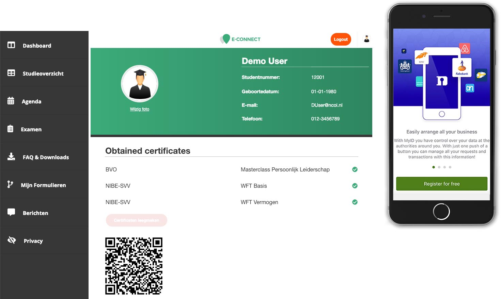
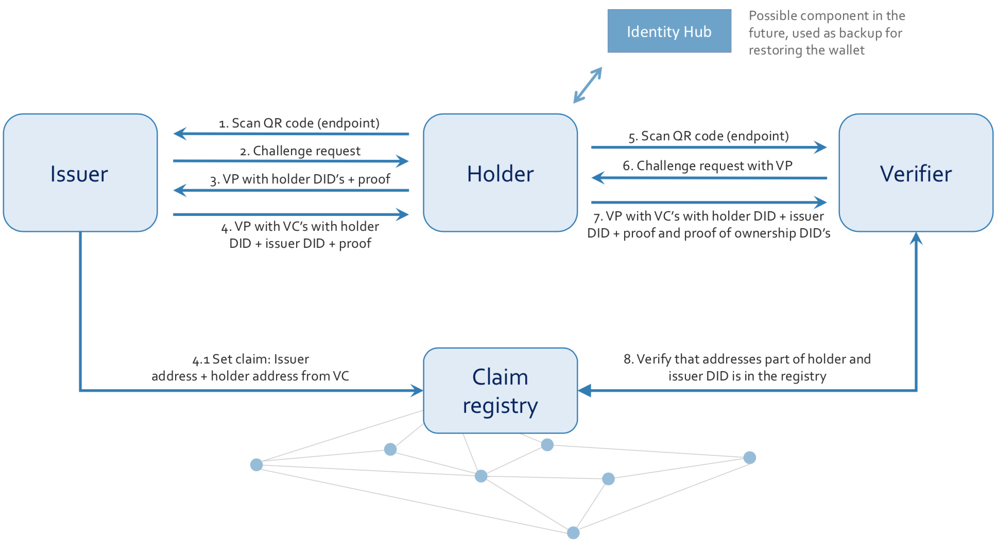
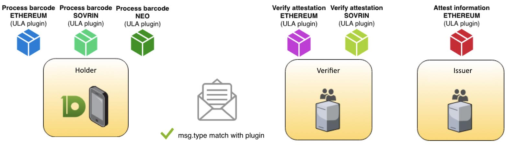
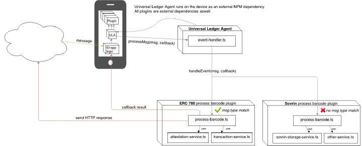

# The universal ledger agent: a logical result of Rabobank's journey in blockchain based self-sovereign identity

By David Lamers &lt;<david.lamers@rabobank.nl>&gt; - v1.0

## Foreword

Within Rabobank we are doing research on self-sovereign identity using blockchain technology since 2016. Within a wide range of partnerships, we explore together with partners the opportunities for the business but also the technical standards and solutions. An interesting keynote of our CEO about the importance of SSI can be found on [Youtube](https://www.youtube.com/watch?v=866C3PAsQFI). Since we are currently working on supporting the [W3C verifiable credentials](https://w3c.github.io/vc-data-model/) (editor's draft January 2019) and [DID's](https://w3c-ccg.github.io/did-spec/), and have designed an Universal Ledger Agent, we are writing this paper to share our work and to open the discussion of the design and implementation. A demo of the current solution can be found on https://youtu.be/TEQ99syPv3A

## Fundamentals

In this section the fundamental concepts of our SSI solution are explained.

* **Holder, issuer and verifier**: We developed a mobile application (using Ionic) for the holder and NodeJS web applications for the issuer and verifier demo’s. For the issuing process, the issuer sends a challenge request to the holder - asking for a DID for each credential so they can be revoked independently whilst maintaining privacy. The holder sends the DID’s back in the form of self-issued verifiable credentials encapsulated in a [verifiable presentation](https://w3c.github.io/vc-data-model/#dfn-verifiable-presentations). The issuer then issues credentials on those DID’s and sends a verifiable presentation back to the holder. The verifier uses the same process, but the challenge request has different content. So the holder sends a verifiable presentation with credentials retrieved from the issuer in the previous step.

TODO: above diagram is draft, improve (text, colors, aligning)

* **Decentralized (pure SSI)**: Pure SSI, without any centralized dependencies and providing all functionalities, is probably only possible with blockchain. Blockchain mainly provides functionalities for timestamping, the trust registry and revoking credentials. In each solution being built we maintain the design principles for self-sovereign identity as explained by [Christopher Allen](http://www.lifewithalacrity.com/2016/04/the-path-to-self-soverereign-identity.html).

* **Trust registry/public claims**: In order to rely on verifiable credentials, the verifier should be able to verify the signature from the issuer. We foresee a role for the government or a chamber of commerce to maintain these trust registries and maybe also provide public claims about those companies.

* **JSON-LD (signatures)**: To create semantic interoperability we use JSON-LD and schema.org definitions when data is exchanged. Signatures are created using the implementation from [Digital Bazaar](https://github.com/digitalbazaar/jsonld-signatures).

* **Personal identity**: We use iDIN to retrieve general information of someone’s personal identity in the mobile app. iDIN is supported by all Dutch banks and provides a basic personal identity of the user. We are currently integrating a party which can provide these credentials on EU level so we can also retrieve identities from outside the Netherlands.

* **Templates**: In the past we worked on JSON-LD templates for communication between holder and verifier/issuer. However, over time we wanted to exchange more data which made templates inefficient. Therefore we are now using challenge requests for the issuing and verify processes. The challenge requests contain information about which credentials the holder will receive, but also which credentials the holder must include in the response. This message can contain additional information, for instance the allowed type of verifiable credentials when multiple types are supported (see also universal ledger agent below).

* **Consortia**: The fundamentals and use cases have been developed within consortia Rabobank is part of, for example [Techruption](https://www.techruption.org/) and the [Dutch Blockchain Coalition](https://dutchblockchaincoalition.org/). The development of SSI should be a common process to create a widely supported and interoperable solution.

* **BIP32**: In the past we used [Bitcoin's BIP32](https://github.com/bitcoin/bips/blob/master/bip-0032.mediawiki) to share derived public extended keys with issuers from which a public key was used as salt in hashes to have an high level of entropy. However, in the summer of 2018 the Dutch Data Protection Authority [decided](https://autoriteitpersoonsgegevens.nl/nl/onderwerpen/beveiliging/beveiliging-van-persoonsgegevens#hoe-werkt-hashing-met-salt-6128) that hashed personal data (with salt) still has to comply with GDPR regulations. To comply with legislation, we don't save hashes anymore but use BIP32 only to create DID's. With the possibilities of key derivation, one has to maintain only one master key.

## Use cases within Rabobank
The development of an SSI solution can provide opportunities for the Rabobank within for instance the following business lines. The added value for the business lines, our customers and employees is the reason we work on SSI.

* **KYC**: Currently, we have extensive know your customer (KYC) and customer due diligence (CDD) processes for retail and wholesale. With hundreds of possible data points these processes are based on, it's complex to retrieve the data from a (direct) verifiable source. SSI could provide directly verifiable data and as bank we have valuable data for the customer for third parties. [Research](http://essay.utwente.nl/71274/) within Rabobank has shown the added value of SSI within KYC.
* **Mortgage**: The average mortgage flow requires a lot of time from the customer. Documents from a lot of resources are required and most of them are not verifiable. The application process takes long which can be improved with SSI
* **HR and onboarding of employees**: we want to empower employees with their own data. It should be possible to reuse certificates or assessments they achieved or did at Rabobank everywhere else. Therefore we do projects in order to save certificates, diplomas, trainings and employment credentials. This means also supporting open badges within W3C verifiable credentials. If we can receive data this way during onboarding, we can also drastically improve onboarding times. It also connects to our vision on the future of work and employee mobility.

##	Universal Ledger Agent
Within our collaborations we faced the problem that partners were using different standards and blockchains. We can also not deny that in the future, multiple solutions will mature and interoperability issues will arise. For users this will be a challenge in the future. Therefore we designed together with one of our partners the Universal Ledger Agent. Plugins can be developed for each specific set of standards (and so blockchains). This section describes our efforts so far.

### Design

The universal ledger agent (ULA) is a component that is implemented by the app and the verifier. The ULA makes it possible to retrieve credentials from issuers, independently which standards and blockchain they use. Also, a verifier can accept and verify credentials from multiple standards. To achieve this interoperability, the ULA uses plugins as shown below.

We are currently working on the Ethereum (ERC-780 as well as W3C verifiable credentials) and Sovrin plugin. The ULA is recognizing the standards used in a credential in order to send it to the right plugin. The plugin takes care of all the logic for the specific standard. In the short future we want to encourage others to build plugins for the ULA. Therefore we are now in the internal process of open sourcing the ULA and our plugins. With open sourcing, we also hope to get more involvement from the community.

### Ledgers
* **Ethereum**: We use the public Ethereum blockchain as credential status registry. Our vision is still to use public infrastructure in order to achieve pure SSI. This credential status registry is a smart contract containing DID's or hashes. Currently there are still challenges in using a public blockchain like scaling and transaction costs. We follow the developments closely and are seeing potential in the solutions being .
* **Indy (with or without Sovrin)**: Despite being a permissioned blockchain, this type of ledger provides less pure SSI. However, if the governance is setup well it might be acceptable. We are following the developments here but it does not have our main focus.
* **X**: each ledger could be supported within the ULA in the future by creating plguins

### Standards
* **ERC-780**: we started with using uPort's ERC-780 Ethereum claim registry. In this claim registry the issuer, subject, key and value are saved. The value is a hash of the original value with a user's derived public key as salt. Derived keys are also used as subject in order to avoid linkability. We don't use ERC-780 in the current solution (see BIP32 part) but they might be useful for public claims or as trust registry,
* **W3C and DID's**: The W3C verifiable credential standard is implemented together with DID's. This means no hashes are saved on the blockchain, only DID's. This makes it a more secure and widely supported solution. This plugin also implements proving ownership of DID's, but we are still doing research on the DID documents.
* **Proof request & responses**: within the Sovrin plugin there is support for proof request and responses as defined by the Sovrin foundation

##	From proof of concepts to pilot
Within Rabobank we did multiple projects with partners to deliver multiple proof of concepts. In the first stages we made the fundamental components more universal. In order to connect data providers or data consumers quickly, we decided to create SSI-as-a-service. With this model, they (or Rabobank) can spin-up a server to issue or verify verifiable credentials. Configurations are e.g. available for their private key, the smart contract being used and on which public keys they rely on (or which trust registry).

Currently we are doing PoC's with test data and want to move to pilots with real users and data. Therefore we are now researching if we meet the requirements of compliance and legal (e.g. GDPR) and cybersecurity. Besides current collaborations, we are also looking at providing a nationwide solution with governmental partners. Together with government and banks we explore the possible setup of a dedicated entity for SSI. An important question remains who should be the owner and so provider of such an SSI solution. Ideally, not every company is providing an identity wallet but there should be one trusted entity providing one. However, a commercial or new entity might not be the best or trusted solution which makes going to production a challenge.

##	Research activities
Besides our current activities we are doing research on a wide range of topics. We encourage parties to think along on these topics with us, or as input for the design workshops of RWOT8.
* **DID documents and the universal resolver**: despite we support DID's, we didn't make the final designs for implementing DID documents and the universal resolver
* **DID auth / login**: using an identity app to sign in using DID auth
* **Signing documents**: signing documents with the app and attach verifiable credentials
* **Identity hubs**: considerations, requirements, designs and implementation of an identity hub or custodian while pursuing a pure SSI solution 

## Disclaimer
This short paper is only a high-level overview and a selection of the projects we are doing. If you are interested, we would like to have the conversation with you on any topic regarding SSI. Almost none of the outlined solutions and designs were created solely within Rabobank, therefore we would like to acknowledge and thank our partners for their contributions.